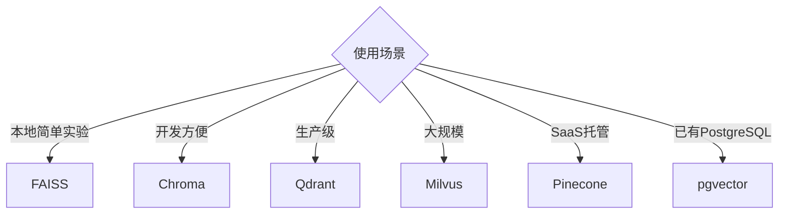

# Vector Database 选型：本地简单方案与企业级生产方案的取舍

FAISS、Chroma、Qdrant、Milvus、Pinecone、pgvector，这么多选择，到底该怎么挑？

## 核心要点

* 常见向量数据库各有特点：FAISS 本地简单、Chroma 开发方便、Qdrant 很适合生产、Milvus 适合大规模、Pinecone 是 SaaS 服务、pgvector 在企业场景中非常实用
* FDE 特别值得掌握 PostgreSQL + pgvector 组合，因为企业本来就大量使用 PostgreSQL 作为业务数据库
* 选型不是越“新潮”越好，而是要结合企业现有的基础设施和运维能力
* 向量数据库只是 RAG 流程中的一环，其效果高度依赖于前面 Chunking 和 Embedding 的质量

---

## 本章测验

本章共 5 道单项选择题。

### 第 1 题

本章提到，哪个向量数据库特别适合企业客户，因为企业本来就大量使用相关的基础数据库？

- A. Pinecone
- B. FAISS
- C. PostgreSQL + pgvector
- D. 纯内存数据库 Redis

选择答案后查看结果

正确答案：C

答案解析：本章强调 pgvector 依托企业已广泛使用的 PostgreSQL，运维和权限管理更容易复用。

### 第 2 题

下列关于各向量数据库特点的描述，哪一项是正确的？

- A. FAISS 是专门的云端托管服务
- B. Milvus 只能用于小规模测试
- C. Pinecone 必须自建服务器才能使用
- D. FAISS 适合本地简单场景，Milvus 适合大规模场景，Pinecone 是 SaaS 托管服务

选择答案后查看结果

正确答案：D

答案解析：本章列出的对照表明确指出了这些数据库各自的定位。

### 第 3 题

本章认为向量数据库选型应主要考虑什么因素？

- A. 企业现有的基础设施和运维能力，而非单纯追求技术新潮
- B. 只看哪个数据库发布时间最新
- C. 只看哪个数据库名字更容易记忆
- D. 完全随机选择即可，不影响项目效果

选择答案后查看结果

正确答案：A

答案解析：本章明确指出选型应结合企业实际情况，而不是盲目追求新技术。

### 第 4 题

选好向量数据库之后，是否就能保证检索效果良好？

- A. 能，向量数据库选对了检索效果就一定好
- B. 不能，检索效果还高度依赖前面的 Chunking 和 Embedding 质量
- C. 不能，因为向量数据库本身完全不影响检索效果
- D. 能，只要向量数据库版本足够新即可

选择答案后查看结果

正确答案：B

答案解析：本章强调向量数据库只是流程中的一环，效果依赖整条链路的质量，尤其是前置的 Chunking 和 Embedding。

### 第 5 题

pgvector 相较于引入全新独立向量数据库的优势主要体现在哪里？

- A. pgvector 的检索速度必然快于所有其他向量数据库
- B. pgvector 不需要任何数据存储空间
- C. 可以复用企业已有的运维、备份和权限管理体系
- D. pgvector 可以自动完成模型训练

选择答案后查看结果

正确答案：C

答案解析：本章提到 pgvector 的核心优势在于与现有 PostgreSQL 基础设施的无缝集成，而非绝对性能优势。

<!-- QUIZ_DATA_START
{
  "chapter": "11",
  "questions": [
    {
      "id": 1,
      "question": "本章提到，哪个向量数据库特别适合企业客户，因为企业本来就大量使用相关的基础数据库？",
      "options": {
        "A": "Pinecone",
        "B": "FAISS",
        "C": "PostgreSQL + pgvector",
        "D": "纯内存数据库 Redis"
      },
      "answer": "C",
      "explanation": "本章强调 pgvector 依托企业已广泛使用的 PostgreSQL，运维和权限管理更容易复用。"
    },
    {
      "id": 2,
      "question": "下列关于各向量数据库特点的描述，哪一项是正确的？",
      "options": {
        "A": "FAISS 是专门的云端托管服务",
        "B": "Milvus 只能用于小规模测试",
        "C": "Pinecone 必须自建服务器才能使用",
        "D": "FAISS 适合本地简单场景，Milvus 适合大规模场景，Pinecone 是 SaaS 托管服务"
      },
      "answer": "D",
      "explanation": "本章列出的对照表明确指出了这些数据库各自的定位。"
    },
    {
      "id": 3,
      "question": "本章认为向量数据库选型应主要考虑什么因素？",
      "options": {
        "A": "企业现有的基础设施和运维能力，而非单纯追求技术新潮",
        "B": "只看哪个数据库发布时间最新",
        "C": "只看哪个数据库名字更容易记忆",
        "D": "完全随机选择即可，不影响项目效果"
      },
      "answer": "A",
      "explanation": "本章明确指出选型应结合企业实际情况，而不是盲目追求新技术。"
    },
    {
      "id": 4,
      "question": "选好向量数据库之后，是否就能保证检索效果良好？",
      "options": {
        "A": "能，向量数据库选对了检索效果就一定好",
        "B": "不能，检索效果还高度依赖前面的 Chunking 和 Embedding 质量",
        "C": "不能，因为向量数据库本身完全不影响检索效果",
        "D": "能，只要向量数据库版本足够新即可"
      },
      "answer": "B",
      "explanation": "本章强调向量数据库只是流程中的一环，效果依赖整条链路的质量，尤其是前置的 Chunking 和 Embedding。"
    },
    {
      "id": 5,
      "question": "pgvector 相较于引入全新独立向量数据库的优势主要体现在哪里？",
      "options": {
        "A": "pgvector 的检索速度必然快于所有其他向量数据库",
        "B": "pgvector 不需要任何数据存储空间",
        "C": "可以复用企业已有的运维、备份和权限管理体系",
        "D": "pgvector 可以自动完成模型训练"
      },
      "answer": "C",
      "explanation": "本章提到 pgvector 的核心优势在于与现有 PostgreSQL 基础设施的无缝集成，而非绝对性能优势。"
    }
  ]
}
QUIZ_DATA_END -->
