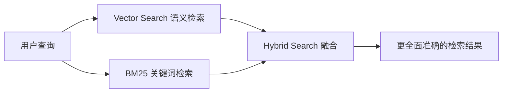

# 纯向量检索不够用：为什么需要 Hybrid Search

如果用户搜索的是“ORA-12514”这样的错误代码，纯语义向量检索一定能找到吗？

## 核心要点

* 纯向量检索（Vector Search）并不总是足够，例如面对精确的错误代码 ORA-12514 这类查询，语义相似度未必是最佳匹配方式
* 关键词检索（例如 BM25）在这类精确匹配场景中可能表现得更准确
* 企业级 RAG 通常采用 Vector Search 加 BM25 的组合方式，即 Hybrid Search 混合检索
* Hybrid Search 结合了语义理解的泛化能力和关键词匹配的精确性，两者互补

---

## 本章测验

本章共 5 道单项选择题。

### 第 1 题

本章用什么例子说明纯向量检索可能不够用？

- A. 用户搜索一段很长的自然语言描述
- B. 用户搜索公司的年度报告
- C. 用户搜索一张图片
- D. 用户搜索精确的错误代码，例如 ORA-12514

选择答案后查看结果

正确答案：D

答案解析：本章用 ORA-12514 这个错误代码的例子说明精确匹配场景下向量检索可能不是最优选择。

### 第 2 题

在 Hybrid Search 中，BM25 主要承担什么角色？

- A. 基于关键词的精确匹配检索
- B. 负责将文本转换为向量
- C. 负责生成最终的自然语言回答
- D. 负责管理用户的登录权限

选择答案后查看结果

正确答案：A

答案解析：本章提到 BM25 是一种关键词检索算法，用于弥补语义检索在精确匹配上的不足。

### 第 3 题

Hybrid Search 的核心思路是什么？

- A. 完全放弃向量检索，只使用关键词检索
- B. 同时使用向量检索和关键词检索，并将两者结果融合
- C. 完全放弃关键词检索，只使用向量检索
- D. 随机选择一种检索方式，忽略另一种

选择答案后查看结果

正确答案：B

答案解析：本章明确说明 Hybrid Search 是 Vector Search 与 BM25 的结合，而不是二选一。

### 第 4 题

如果一个企业 RAG 系统只使用纯向量检索，可能面临什么风险？

- A. 系统运行速度会变得无限快
- B. 系统将完全无法处理任何查询
- C. 可能漏掉需要精确字符匹配的内容，例如错误代码或特定编号
- D. 系统会自动切换为纯关键词检索

选择答案后查看结果

正确答案：C

答案解析：本章指出纯语义检索在处理精确标识符类查询时存在局限性。

### 第 5 题

本章为什么说 Hybrid Search 在企业场景里“几乎是标配”？

- A. 因为它是唯一被官方认证的检索方式
- B. 因为它的实现成本远低于其他任何方案
- C. 因为它不需要任何额外的计算资源
- D. 因为它能同时覆盖语义相近内容和精确关键词匹配，弥补单一检索方式的短板

选择答案后查看结果

正确答案：D

答案解析：本章总结指出 Hybrid Search 结合了两种检索方式的优势，因此在生产级 RAG 系统中被广泛采用。

<!-- QUIZ_DATA_START
{
  "chapter": "12",
  "questions": [
    {
      "id": 1,
      "question": "本章用什么例子说明纯向量检索可能不够用？",
      "options": {
        "A": "用户搜索一段很长的自然语言描述",
        "B": "用户搜索公司的年度报告",
        "C": "用户搜索一张图片",
        "D": "用户搜索精确的错误代码，例如 ORA-12514"
      },
      "answer": "D",
      "explanation": "本章用 ORA-12514 这个错误代码的例子说明精确匹配场景下向量检索可能不是最优选择。"
    },
    {
      "id": 2,
      "question": "在 Hybrid Search 中，BM25 主要承担什么角色？",
      "options": {
        "A": "基于关键词的精确匹配检索",
        "B": "负责将文本转换为向量",
        "C": "负责生成最终的自然语言回答",
        "D": "负责管理用户的登录权限"
      },
      "answer": "A",
      "explanation": "本章提到 BM25 是一种关键词检索算法，用于弥补语义检索在精确匹配上的不足。"
    },
    {
      "id": 3,
      "question": "Hybrid Search 的核心思路是什么？",
      "options": {
        "A": "完全放弃向量检索，只使用关键词检索",
        "B": "同时使用向量检索和关键词检索，并将两者结果融合",
        "C": "完全放弃关键词检索，只使用向量检索",
        "D": "随机选择一种检索方式，忽略另一种"
      },
      "answer": "B",
      "explanation": "本章明确说明 Hybrid Search 是 Vector Search 与 BM25 的结合，而不是二选一。"
    },
    {
      "id": 4,
      "question": "如果一个企业 RAG 系统只使用纯向量检索，可能面临什么风险？",
      "options": {
        "A": "系统运行速度会变得无限快",
        "B": "系统将完全无法处理任何查询",
        "C": "可能漏掉需要精确字符匹配的内容，例如错误代码或特定编号",
        "D": "系统会自动切换为纯关键词检索"
      },
      "answer": "C",
      "explanation": "本章指出纯语义检索在处理精确标识符类查询时存在局限性。"
    },
    {
      "id": 5,
      "question": "本章为什么说 Hybrid Search 在企业场景里“几乎是标配”？",
      "options": {
        "A": "因为它是唯一被官方认证的检索方式",
        "B": "因为它的实现成本远低于其他任何方案",
        "C": "因为它不需要任何额外的计算资源",
        "D": "因为它能同时覆盖语义相近内容和精确关键词匹配，弥补单一检索方式的短板"
      },
      "answer": "D",
      "explanation": "本章总结指出 Hybrid Search 结合了两种检索方式的优势，因此在生产级 RAG 系统中被广泛采用。"
    }
  ]
}
QUIZ_DATA_END -->
