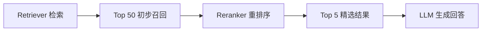

# Reranker：从 Top 50 到 Top 5 的关键一步

检索先召回 50 条结果，直接把 50 条都塞给大模型可以吗？

## 核心要点

* 典型生产流程是：Retriever 先召回 Top 50，再经过 Reranker 精排为 Top 5，最后才交给 LLM
* Reranker 可以显著提高检索质量，弥补初步检索阶段召回结果相关性不够精准的问题
* 常见 Reranker 包括 BGE Reranker、Cohere Rerank、Cross Encoder 等
* Embedding（向量化召回）和 Reranking（重排序）是两个不同的问题，分别对应不同的模型和优化目标

---

## 本章测验

本章共 5 道单项选择题。

### 第 1 题

生产级检索流程中，Reranker 通常处于哪个位置？

- A. 在 Retriever 初步召回之后、交给 LLM 之前
- B. 在用户提交查询之前
- C. 在 LLM 生成答案之后
- D. 在 Embedding 模型训练之前

选择答案后查看结果

正确答案：A

答案解析：典型流程是 Retriever 召回 Top 50，Reranker 精排为 Top 5，再交给 LLM。

### 第 2 题

为什么初步检索阶段通常会召回相对较多的候选结果（例如 Top 50），而不是直接召回 Top 5？

- A. 因为系统故意浪费计算资源
- B. 初步检索追求较高的召回率，避免漏掉相关内容，精确排序留给后续的 Reranker 处理
- C. 因为 Top 5 在技术上无法实现
- D. 因为用户要求必须看到 50 条结果

选择答案后查看结果

正确答案：B

答案解析：本章说明初步检索和 Reranker 的分工不同：前者保证覆盖面，后者保证精确度。

### 第 3 题

下列哪一组属于本章提到的 Reranker 相关模型或方法？

- A. FAISS、Milvus、Qdrant
- B. Docker、Kubernetes、Terraform
- C. BGE Reranker、Cohere Rerank、Cross Encoder
- D. React、Vue、Angular

选择答案后查看结果

正确答案：C

答案解析：这些是本章列举的常见 Reranker 实现方式。

### 第 4 题

本章如何区分 Embedding 和 Reranking 这两个概念？

- A. Embedding 和 Reranking 是完全相同的技术，只是名字不同
- B. Reranking 用于生成文本，Embedding 用于翻译文本
- C. Embedding 只用于图片，Reranking 只用于文字
- D. Embedding 用于从海量文档中快速召回候选集合，Reranking 用于在候选集合中精确排序找出最相关内容

选择答案后查看结果

正确答案：D

答案解析：本章明确指出两者是检索流程中不同阶段的不同问题，各有侧重。

### 第 5 题

如果跳过 Reranker，直接把初步召回的大量候选结果都交给 LLM，可能带来什么问题？

- A. 上下文变长、成本升高，且不相关内容可能干扰模型判断
- B. 系统会自动变得更快更便宜
- C. 回答质量必然会显著提升
- D. 不会产生任何负面影响

选择答案后查看结果

正确答案：A

答案解析：本章指出跳过精排步骤会导致上下文冗长、成本增加，并可能引入干扰信息。

<!-- QUIZ_DATA_START
{
  "chapter": "13",
  "questions": [
    {
      "id": 1,
      "question": "生产级检索流程中，Reranker 通常处于哪个位置？",
      "options": {
        "A": "在 Retriever 初步召回之后、交给 LLM 之前",
        "B": "在用户提交查询之前",
        "C": "在 LLM 生成答案之后",
        "D": "在 Embedding 模型训练之前"
      },
      "answer": "A",
      "explanation": "典型流程是 Retriever 召回 Top 50，Reranker 精排为 Top 5，再交给 LLM。"
    },
    {
      "id": 2,
      "question": "为什么初步检索阶段通常会召回相对较多的候选结果（例如 Top 50），而不是直接召回 Top 5？",
      "options": {
        "A": "因为系统故意浪费计算资源",
        "B": "初步检索追求较高的召回率，避免漏掉相关内容，精确排序留给后续的 Reranker 处理",
        "C": "因为 Top 5 在技术上无法实现",
        "D": "因为用户要求必须看到 50 条结果"
      },
      "answer": "B",
      "explanation": "本章说明初步检索和 Reranker 的分工不同：前者保证覆盖面，后者保证精确度。"
    },
    {
      "id": 3,
      "question": "下列哪一组属于本章提到的 Reranker 相关模型或方法？",
      "options": {
        "A": "FAISS、Milvus、Qdrant",
        "B": "Docker、Kubernetes、Terraform",
        "C": "BGE Reranker、Cohere Rerank、Cross Encoder",
        "D": "React、Vue、Angular"
      },
      "answer": "C",
      "explanation": "这些是本章列举的常见 Reranker 实现方式。"
    },
    {
      "id": 4,
      "question": "本章如何区分 Embedding 和 Reranking 这两个概念？",
      "options": {
        "A": "Embedding 和 Reranking 是完全相同的技术，只是名字不同",
        "B": "Reranking 用于生成文本，Embedding 用于翻译文本",
        "C": "Embedding 只用于图片，Reranking 只用于文字",
        "D": "Embedding 用于从海量文档中快速召回候选集合，Reranking 用于在候选集合中精确排序找出最相关内容"
      },
      "answer": "D",
      "explanation": "本章明确指出两者是检索流程中不同阶段的不同问题，各有侧重。"
    },
    {
      "id": 5,
      "question": "如果跳过 Reranker，直接把初步召回的大量候选结果都交给 LLM，可能带来什么问题？",
      "options": {
        "A": "上下文变长、成本升高，且不相关内容可能干扰模型判断",
        "B": "系统会自动变得更快更便宜",
        "C": "回答质量必然会显著提升",
        "D": "不会产生任何负面影响"
      },
      "answer": "A",
      "explanation": "本章指出跳过精排步骤会导致上下文冗长、成本增加，并可能引入干扰信息。"
    }
  ]
}
QUIZ_DATA_END -->
