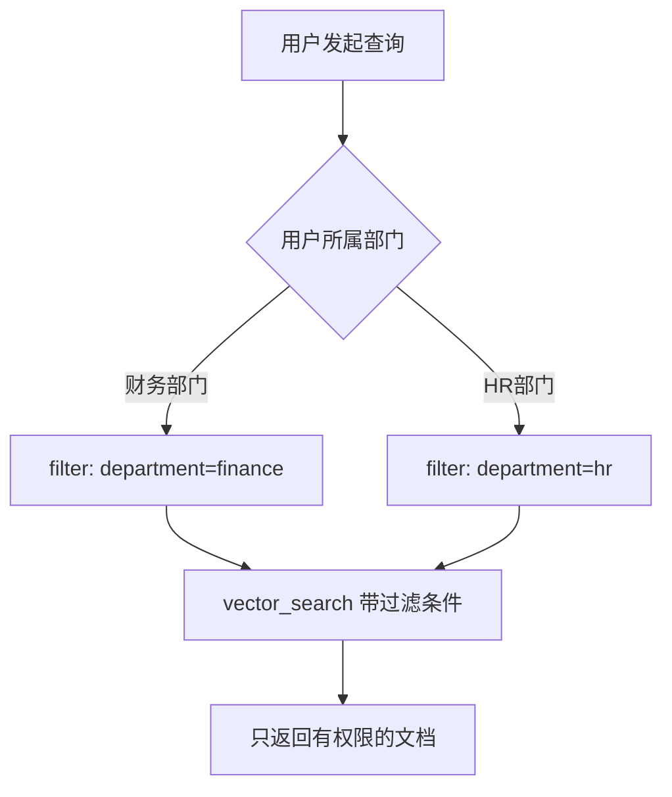

# 权限感知 RAG：教程很少讲，但企业项目里极其重要

如果财务部门的员工搜索问题，检索系统会不会不小心把 HR 部门的机密文件也返回给他？

## 核心要点

* 这是企业项目中特别重要、但教程很少涉及的环节：不同部门/角色的用户通常只能查询自己有权限的数据
* 如果直接执行 vector_search(query) 而不加任何过滤条件，可能导致严重的数据泄露
* 正确做法是在检索时加入 filter 条件，例如按部门（department）等元数据过滤，只在授权范围内检索
* 权限感知能力需要与 Metadata（元数据）设计紧密结合，是安全架构的重要一环

---

## 本章测验

本章共 5 道单项选择题。

### 第 1 题

本章讨论的“权限感知 RAG”主要解决什么问题？

- A. 提升向量检索的召回速度
- B. 防止不同部门或角色的用户通过 AI 系统访问到没有权限查看的数据
- C. 降低向量数据库的存储成本
- D. 提高 Embedding 模型的准确率

选择答案后查看结果

正确答案：B

答案解析：本章聚焦的是数据权限隔离问题，而非检索性能或成本优化。

### 第 2 题

如果直接执行不带过滤条件的 vector_search(query)，可能带来什么风险？

- A. 会导致向量数据库彻底崩溃
- B. 会导致所有检索结果变为空
- C. 可能导致跨部门的数据泄露
- D. 会导致模型自动拒绝回答任何问题

选择答案后查看结果

正确答案：C

答案解析：本章明确指出未加过滤条件的检索可能让用户访问到无权限的数据，造成安全事故。

### 第 3 题

本章建议的正确检索方式是什么？

- A. 取消所有用户的检索权限，只允许管理员使用系统
- B. 把所有文档都设置为公开，避免复杂的权限管理
- C. 让用户自己承诺不查看无关数据
- D. 在检索时加入基于用户部门等元数据的 filter 条件

选择答案后查看结果

正确答案：D

答案解析：本章提出通过 filter 参数结合用户属性（如部门）来限制检索范围。

### 第 4 题

权限感知 RAG 的实现基础是什么？

- A. 在文档入库时打上正确的部门、角色等元数据标签
- B. 完全依赖模型自身判断谁能看什么内容
- C. 依赖用户自觉不查询敏感信息
- D. 依赖服务器的物理位置进行权限划分

选择答案后查看结果

正确答案：A

答案解析：本章强调元数据设计是权限过滤能够落地执行的前提条件。

### 第 5 题

本章为什么强调这个话题“教程很少讲，但企业项目里极其重要”？

- A. 因为这个功能在技术上几乎不可能实现
- B. 因为很多入门教程只关注 RAG 跑通与否，忽视了真实企业场景中的数据安全和权限隔离需求
- C. 因为企业客户从不关心数据安全问题
- D. 因为这个话题与 RAG 技术完全无关

选择答案后查看结果

正确答案：B

答案解析：本章指出这是理论学习和真实企业落地之间的一个典型知识盲区。

<!-- QUIZ_DATA_START
{
  "chapter": "14",
  "questions": [
    {
      "id": 1,
      "question": "本章讨论的“权限感知 RAG”主要解决什么问题？",
      "options": {
        "A": "提升向量检索的召回速度",
        "B": "防止不同部门或角色的用户通过 AI 系统访问到没有权限查看的数据",
        "C": "降低向量数据库的存储成本",
        "D": "提高 Embedding 模型的准确率"
      },
      "answer": "B",
      "explanation": "本章聚焦的是数据权限隔离问题，而非检索性能或成本优化。"
    },
    {
      "id": 2,
      "question": "如果直接执行不带过滤条件的 vector_search(query)，可能带来什么风险？",
      "options": {
        "A": "会导致向量数据库彻底崩溃",
        "B": "会导致所有检索结果变为空",
        "C": "可能导致跨部门的数据泄露",
        "D": "会导致模型自动拒绝回答任何问题"
      },
      "answer": "C",
      "explanation": "本章明确指出未加过滤条件的检索可能让用户访问到无权限的数据，造成安全事故。"
    },
    {
      "id": 3,
      "question": "本章建议的正确检索方式是什么？",
      "options": {
        "A": "取消所有用户的检索权限，只允许管理员使用系统",
        "B": "把所有文档都设置为公开，避免复杂的权限管理",
        "C": "让用户自己承诺不查看无关数据",
        "D": "在检索时加入基于用户部门等元数据的 filter 条件"
      },
      "answer": "D",
      "explanation": "本章提出通过 filter 参数结合用户属性（如部门）来限制检索范围。"
    },
    {
      "id": 4,
      "question": "权限感知 RAG 的实现基础是什么？",
      "options": {
        "A": "在文档入库时打上正确的部门、角色等元数据标签",
        "B": "完全依赖模型自身判断谁能看什么内容",
        "C": "依赖用户自觉不查询敏感信息",
        "D": "依赖服务器的物理位置进行权限划分"
      },
      "answer": "A",
      "explanation": "本章强调元数据设计是权限过滤能够落地执行的前提条件。"
    },
    {
      "id": 5,
      "question": "本章为什么强调这个话题“教程很少讲，但企业项目里极其重要”？",
      "options": {
        "A": "因为这个功能在技术上几乎不可能实现",
        "B": "因为很多入门教程只关注 RAG 跑通与否，忽视了真实企业场景中的数据安全和权限隔离需求",
        "C": "因为企业客户从不关心数据安全问题",
        "D": "因为这个话题与 RAG 技术完全无关"
      },
      "answer": "B",
      "explanation": "本章指出这是理论学习和真实企业落地之间的一个典型知识盲区。"
    }
  ]
}
QUIZ_DATA_END -->
