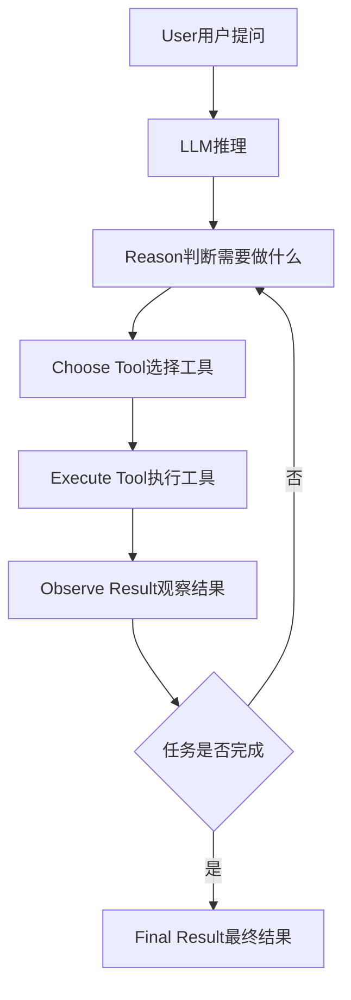

# 从 Chatbot 到 Agent：区别不只是多轮对话

Chatbot 只会回答问题，Agent 却能“动手做事”，这个能力差异是怎么实现的？

## 核心要点

* Chatbot 的基本模式是：用户提问 → LLM 处理 → 给出答案，是一个相对简单的单向流程
* Agent 的模式则是循环式的：推理 → 选择工具 → 执行工具 → 观察结果 → 再次推理 → 选择下一步行动，直到得出最终结果
* 典型例子：找出昨天销售下降超过20%的商品并通知销售负责人，需要依次调用 SQL 工具、Python 工具、CRM 工具、Slack 工具等多个环节
* Agent 的核心本质可以概括为：LLM + Tools（工具）+ Memory（记忆）+ Workflow（工作流）

---

## 本章测验

本章共 5 道单项选择题。

### 第 1 题

Chatbot 和 Agent 最本质的区别是什么？

- A. Chatbot 只能用英文，Agent 只能用中文
- B. Chatbot 运行在云端，Agent 只能运行在本地
- C. Chatbot 是单向的问答流程，Agent 是循环式的推理、执行、观察、再推理的过程
- D. Chatbot 不需要 LLM，Agent 才需要 LLM

选择答案后查看结果

正确答案：C

答案解析：本章明确对比了两者的工作模式差异：单向问答 vs 循环式行动。

### 第 2 题

在“找出销售下降超过20%的商品并通知负责人”的例子中，Agent 依次调用了哪些工具？

- A. 仅使用了一个通用聊天工具完成全部任务
- B. 仅调用了图像生成工具
- C. 仅调用了翻译工具
- D. SQL 工具、Python 工具、CRM 工具、Slack 工具

选择答案后查看结果

正确答案：D

答案解析：本章例子中展示了 Agent 如何依次调用多个不同类型的工具完成一个完整任务。

### 第 3 题

本章将 Agent 的本质概括为哪个公式？

- A. LLM + Tools + Memory + Workflow
- B. LLM + GPU + 数据库
- C. Prompt + Token + Temperature
- D. 前端 + 后端 + 数据库

选择答案后查看结果

正确答案：A

答案解析：本章明确给出了这个公式，用于总结 Agent 的核心构成要素。

### 第 4 题

Agent 循环流程中，“Observe Result”这一步的作用是什么？

- A. 直接结束整个任务流程
- B. 观察工具执行后的结果，作为下一步推理决策的依据
- C. 跳过所有后续步骤
- D. 自动删除之前的执行记录

选择答案后查看结果

正确答案：B

答案解析：本章的流程图显示 Observe Result 之后会回到 Reason 阶段，用于决定下一步行动。

### 第 5 题

本章认为 Agent 相较于 Chatbot 最重要的能力是什么？

- A. 更流畅的自然语言表达能力
- B. 更快的打字速度
- C. 行动能力，即能够真正执行任务而不仅仅是回答问题
- D. 更漂亮的界面设计

选择答案后查看结果

正确答案：C

答案解析：本章总结指出 Agent 最重要的不是聊天，而是能够采取实际行动完成任务。

<!-- QUIZ_DATA_START
{
  "chapter": "15",
  "questions": [
    {
      "id": 1,
      "question": "Chatbot 和 Agent 最本质的区别是什么？",
      "options": {
        "A": "Chatbot 只能用英文，Agent 只能用中文",
        "B": "Chatbot 运行在云端，Agent 只能运行在本地",
        "C": "Chatbot 是单向的问答流程，Agent 是循环式的推理、执行、观察、再推理的过程",
        "D": "Chatbot 不需要 LLM，Agent 才需要 LLM"
      },
      "answer": "C",
      "explanation": "本章明确对比了两者的工作模式差异：单向问答 vs 循环式行动。"
    },
    {
      "id": 2,
      "question": "在“找出销售下降超过20%的商品并通知负责人”的例子中，Agent 依次调用了哪些工具？",
      "options": {
        "A": "仅使用了一个通用聊天工具完成全部任务",
        "B": "仅调用了图像生成工具",
        "C": "仅调用了翻译工具",
        "D": "SQL 工具、Python 工具、CRM 工具、Slack 工具"
      },
      "answer": "D",
      "explanation": "本章例子中展示了 Agent 如何依次调用多个不同类型的工具完成一个完整任务。"
    },
    {
      "id": 3,
      "question": "本章将 Agent 的本质概括为哪个公式？",
      "options": {
        "A": "LLM + Tools + Memory + Workflow",
        "B": "LLM + GPU + 数据库",
        "C": "Prompt + Token + Temperature",
        "D": "前端 + 后端 + 数据库"
      },
      "answer": "A",
      "explanation": "本章明确给出了这个公式，用于总结 Agent 的核心构成要素。"
    },
    {
      "id": 4,
      "question": "Agent 循环流程中，“Observe Result”这一步的作用是什么？",
      "options": {
        "A": "直接结束整个任务流程",
        "B": "观察工具执行后的结果，作为下一步推理决策的依据",
        "C": "跳过所有后续步骤",
        "D": "自动删除之前的执行记录"
      },
      "answer": "B",
      "explanation": "本章的流程图显示 Observe Result 之后会回到 Reason 阶段，用于决定下一步行动。"
    },
    {
      "id": 5,
      "question": "本章认为 Agent 相较于 Chatbot 最重要的能力是什么？",
      "options": {
        "A": "更流畅的自然语言表达能力",
        "B": "更快的打字速度",
        "C": "行动能力，即能够真正执行任务而不仅仅是回答问题",
        "D": "更漂亮的界面设计"
      },
      "answer": "C",
      "explanation": "本章总结指出 Agent 最重要的不是聊天，而是能够采取实际行动完成任务。"
    }
  ]
}
QUIZ_DATA_END -->
