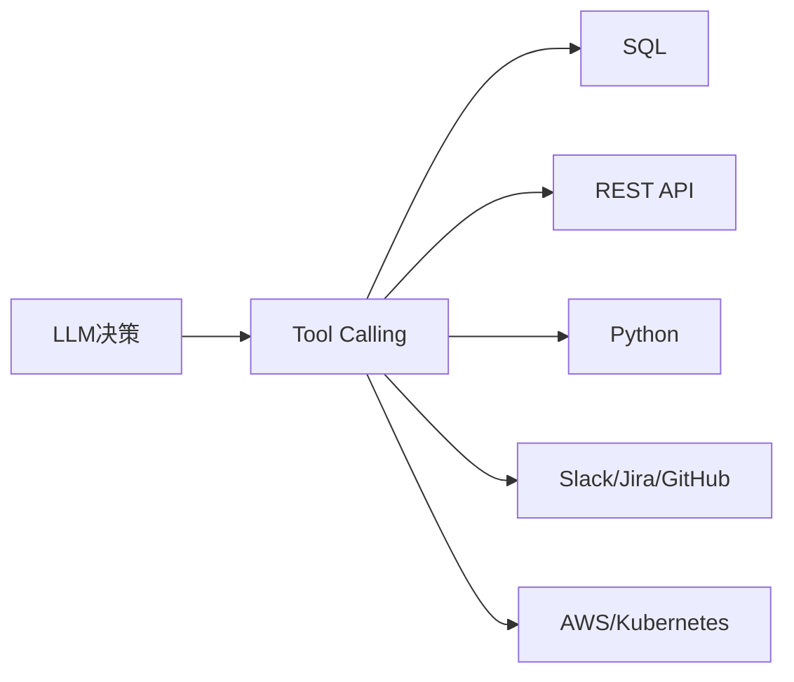

# Tool Calling：Agent 真正的行动能力

如果说 Agent 的核心是“行动”，那么它到底是通过什么机制“动手”的？

## 核心要点

* Agent 最重要的不是聊天，而是行动，而行动的核心机制就是 Tool Calling（工具调用）
* 常见工具类型包括：SQL、REST API、Browser、Python、Filesystem、Email、Slack、Teams、Jira、GitHub、Salesforce、ServiceNow、SAP、AWS、Kubernetes
* Agent 的能力本质上可以理解为：LLM + Tools + Memory + Workflow 的组合体现
* 掌握 Tool Calling 意味着理解如何让 LLM 准确判断“该用哪个工具、传什么参数、如何处理返回结果”

---

## 本章测验

本章共 5 道单项选择题。

### 第 1 题

本章认为 Agent 最重要的能力体现在哪里，而 Tool Calling 是实现这一能力的核心机制？

- A. 聊天流畅度
- B. 界面美观度
- C. 响应速度
- D. 行动能力

选择答案后查看结果

正确答案：D

答案解析：本章延续上一章的结论，强调行动是 Agent 的核心，Tool Calling 是实现行动的机制。

### 第 2 题

下列哪一组属于本章列举的 Agent 常见工具类型？

- A. SQL、REST API、Python、Slack、GitHub、AWS、Kubernetes
- B. Photoshop、Illustrator、Figma
- C. PowerPoint、Word、Excel 的字体设置
- D. 仅限于图像生成类工具

选择答案后查看结果

正确答案：A

答案解析：本章列出的工具类型覆盖数据库、API、代码执行、协作平台和基础设施等广泛范围。

### 第 3 题

LLM 本身为什么无法直接完成“查数据库”或“发消息”这类操作？

- A. LLM 被厂商禁止执行任何操作
- B. LLM 本身只能生成文字，必须通过调用外部工具才能执行实际动作
- C. LLM 缺乏足够的参数量
- D. LLM 只能处理图片，不能处理文字

选择答案后查看结果

正确答案：B

答案解析：本章说明了 LLM 的天然局限性：只能生成文本，实际动作依赖工具调用来完成。

### 第 4 题

如果 LLM 在 Tool Calling 过程中选错了工具或传错了参数，可能造成什么后果？

- A. 系统会自动纠正错误，不产生任何影响
- B. 只会影响响应速度，不会有其他后果
- C. 任务执行失败，甚至产生误删数据或发错消息等副作用
- D. LLM 会自动停止工作且无法恢复

选择答案后查看结果

正确答案：C

答案解析：本章强调工具调用错误可能带来实际的负面后果，因此需要谨慎设计参数校验和结果观察机制。

### 第 5 题

本章如何总结 Agent 能力与 Tool Calling 之间的关系？

- A. Tool Calling 与 Agent 的核心能力完全无关
- B. Tool Calling 只是一个可有可无的附加功能
- C. Tool Calling 只适用于简单的单步任务
- D. Tool Calling 是让 LLM、Tools、Memory、Workflow 这一整套组合真正运转起来的关键环节

选择答案后查看结果

正确答案：D

答案解析：本章总结 Tool Calling 是串联整个 Agent 能力体系的核心机制。

<!-- QUIZ_DATA_START
{
  "chapter": "16",
  "questions": [
    {
      "id": 1,
      "question": "本章认为 Agent 最重要的能力体现在哪里，而 Tool Calling 是实现这一能力的核心机制？",
      "options": {
        "A": "聊天流畅度",
        "B": "界面美观度",
        "C": "响应速度",
        "D": "行动能力"
      },
      "answer": "D",
      "explanation": "本章延续上一章的结论，强调行动是 Agent 的核心，Tool Calling 是实现行动的机制。"
    },
    {
      "id": 2,
      "question": "下列哪一组属于本章列举的 Agent 常见工具类型？",
      "options": {
        "A": "SQL、REST API、Python、Slack、GitHub、AWS、Kubernetes",
        "B": "Photoshop、Illustrator、Figma",
        "C": "PowerPoint、Word、Excel 的字体设置",
        "D": "仅限于图像生成类工具"
      },
      "answer": "A",
      "explanation": "本章列出的工具类型覆盖数据库、API、代码执行、协作平台和基础设施等广泛范围。"
    },
    {
      "id": 3,
      "question": "LLM 本身为什么无法直接完成“查数据库”或“发消息”这类操作？",
      "options": {
        "A": "LLM 被厂商禁止执行任何操作",
        "B": "LLM 本身只能生成文字，必须通过调用外部工具才能执行实际动作",
        "C": "LLM 缺乏足够的参数量",
        "D": "LLM 只能处理图片，不能处理文字"
      },
      "answer": "B",
      "explanation": "本章说明了 LLM 的天然局限性：只能生成文本，实际动作依赖工具调用来完成。"
    },
    {
      "id": 4,
      "question": "如果 LLM 在 Tool Calling 过程中选错了工具或传错了参数，可能造成什么后果？",
      "options": {
        "A": "系统会自动纠正错误，不产生任何影响",
        "B": "只会影响响应速度，不会有其他后果",
        "C": "任务执行失败，甚至产生误删数据或发错消息等副作用",
        "D": "LLM 会自动停止工作且无法恢复"
      },
      "answer": "C",
      "explanation": "本章强调工具调用错误可能带来实际的负面后果，因此需要谨慎设计参数校验和结果观察机制。"
    },
    {
      "id": 5,
      "question": "本章如何总结 Agent 能力与 Tool Calling 之间的关系？",
      "options": {
        "A": "Tool Calling 与 Agent 的核心能力完全无关",
        "B": "Tool Calling 只是一个可有可无的附加功能",
        "C": "Tool Calling 只适用于简单的单步任务",
        "D": "Tool Calling 是让 LLM、Tools、Memory、Workflow 这一整套组合真正运转起来的关键环节"
      },
      "answer": "D",
      "explanation": "本章总结 Tool Calling 是串联整个 Agent 能力体系的核心机制。"
    }
  ]
}
QUIZ_DATA_END -->
