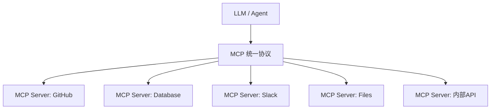

# MCP：让 Agent 不必为每个系统单独写集成代码

如果每个 Agent 都要单独对接 Slack、GitHub、Jira、数据库的 API，会变成什么局面？

## 核心要点

* 在没有统一协议之前，每个 Agent 往往要单独对接各系统的 API，形成混乱的多对多集成关系
* MCP（Model Context Protocol）相当于定义了一套统一协议，Agent 不需要了解每个系统的具体实现细节，只需要看到统一暴露的 Tools、Resources、Prompts
* 到 2026 年，MCP 已经明显向企业生产场景发展，官方路线图重点推进 agent communication、transport scalability、governance、agent identity 和企业安全
* 企业集中身份授权已经成为 MCP 发展的重要方向，学习 MCP 已经不是追热点，而是在打基础设施能力

---

## 本章测验

本章共 5 道单项选择题。

### 第 1 题

在没有统一协议之前，Agent 对接各系统 API 会形成什么局面？

- A. 混乱的多对多集成关系，维护成本很高
- B. 非常整洁统一，没有任何维护成本
- C. 所有系统会自动互相兼容，无需额外开发
- D. Agent 完全不需要访问任何外部系统

选择答案后查看结果

正确答案：A

答案解析：本章指出没有统一协议时，每个 Agent 单独对接每个系统会造成混乱且难以维护的局面。

### 第 2 题

MCP 协议的核心作用是什么？

- A. MCP 是一种新的编程语言，用来替代 Python
- B. 定义统一协议，让 Agent 通过标准化的 Tools、Resources、Prompts 接入各系统，无需了解具体实现细节
- C. MCP 是一种专门用于训练大模型的算法
- D. MCP 是一种前端 UI 框架

选择答案后查看结果

正确答案：B

答案解析：本章明确说明 MCP 是一种统一的协议标准，用于简化 Agent 与外部系统的集成。

### 第 3 题

根据本章描述，到 2026 年 MCP 官方路线图重点推进的方向包括哪些？

- A. 仅专注于提升前端渲染速度
- B. 仅专注于降低服务器电费成本
- C. agent communication、transport scalability、governance、agent identity、企业安全
- D. 仅专注于优化图片压缩算法

选择答案后查看结果

正确答案：C

答案解析：本章列举了 MCP 官方路线图中的具体重点发展方向。

### 第 4 题

本章提到，企业对 MCP 发展提出的哪个重要方向？

- A. 完全取消所有身份验证机制
- B. 只允许单一用户使用系统
- C. 禁止 Agent 访问任何企业数据
- D. 企业集中式身份授权（agent identity 与 enterprise authorization）

选择答案后查看结果

正确答案：D

答案解析：本章提到企业集中身份授权已成为 MCP 发展的重要方向，反映了 Agent 进入企业后的核心安全需求。

### 第 5 题

本章如何评价当前学习 MCP 的意义？

- A. MCP 正在成为 Agent 集成的重要基础设施，不只是追逐技术热点
- B. MCP 只是短期流行的营销概念，不值得投入学习
- C. MCP 已经被行业淘汰，不再有实际价值
- D. MCP 与企业级 Agent 开发完全无关

选择答案后查看结果

正确答案：A

答案解析：本章总结指出 MCP 正朝企业生产场景发展，学习它是在为未来的 Agent 集成打基础，而非追逐热点。

<!-- QUIZ_DATA_START
{
  "chapter": "17",
  "questions": [
    {
      "id": 1,
      "question": "在没有统一协议之前，Agent 对接各系统 API 会形成什么局面？",
      "options": {
        "A": "混乱的多对多集成关系，维护成本很高",
        "B": "非常整洁统一，没有任何维护成本",
        "C": "所有系统会自动互相兼容，无需额外开发",
        "D": "Agent 完全不需要访问任何外部系统"
      },
      "answer": "A",
      "explanation": "本章指出没有统一协议时，每个 Agent 单独对接每个系统会造成混乱且难以维护的局面。"
    },
    {
      "id": 2,
      "question": "MCP 协议的核心作用是什么？",
      "options": {
        "A": "MCP 是一种新的编程语言，用来替代 Python",
        "B": "定义统一协议，让 Agent 通过标准化的 Tools、Resources、Prompts 接入各系统，无需了解具体实现细节",
        "C": "MCP 是一种专门用于训练大模型的算法",
        "D": "MCP 是一种前端 UI 框架"
      },
      "answer": "B",
      "explanation": "本章明确说明 MCP 是一种统一的协议标准，用于简化 Agent 与外部系统的集成。"
    },
    {
      "id": 3,
      "question": "根据本章描述，到 2026 年 MCP 官方路线图重点推进的方向包括哪些？",
      "options": {
        "A": "仅专注于提升前端渲染速度",
        "B": "仅专注于降低服务器电费成本",
        "C": "agent communication、transport scalability、governance、agent identity、企业安全",
        "D": "仅专注于优化图片压缩算法"
      },
      "answer": "C",
      "explanation": "本章列举了 MCP 官方路线图中的具体重点发展方向。"
    },
    {
      "id": 4,
      "question": "本章提到，企业对 MCP 发展提出的哪个重要方向？",
      "options": {
        "A": "完全取消所有身份验证机制",
        "B": "只允许单一用户使用系统",
        "C": "禁止 Agent 访问任何企业数据",
        "D": "企业集中式身份授权（agent identity 与 enterprise authorization）"
      },
      "answer": "D",
      "explanation": "本章提到企业集中身份授权已成为 MCP 发展的重要方向，反映了 Agent 进入企业后的核心安全需求。"
    },
    {
      "id": 5,
      "question": "本章如何评价当前学习 MCP 的意义？",
      "options": {
        "A": "MCP 正在成为 Agent 集成的重要基础设施，不只是追逐技术热点",
        "B": "MCP 只是短期流行的营销概念，不值得投入学习",
        "C": "MCP 已经被行业淘汰，不再有实际价值",
        "D": "MCP 与企业级 Agent 开发完全无关"
      },
      "answer": "A",
      "explanation": "本章总结指出 MCP 正朝企业生产场景发展，学习它是在为未来的 Agent 集成打基础，而非追逐热点。"
    }
  ]
}
QUIZ_DATA_END -->
