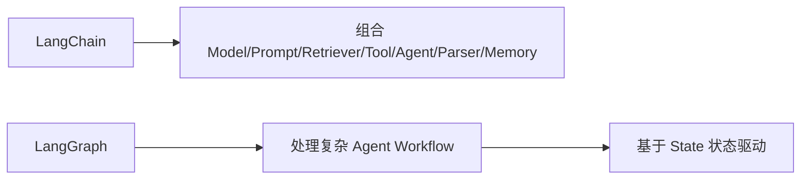

# LangChain 该会，但不要迷信；LangGraph 更值得深入

学 Agent 开发，是不是把 LangChain 的 API 背熟就够了？

## 核心要点

* LangChain 主要解决 Model、Prompt、Retriever、Tool、Agent、Parser、Memory 等组件之间的组合问题，适合快速开发
* FDE 最重要的不是“会 LangChain API”，而是即使不用 LangChain，也清楚它背后到底帮你完成了什么
* LangGraph 解决的是更复杂的 Agent Workflow 问题，因为现实中的 Agent 任务往往不是简单的“问题到答案”，而是包含分支判断、重试、多步骤的复杂流程
* 建议的学习优先顺序是：Python → LLM API → Tool Calling → RAG → LangGraph → MCP → Eval

---

## 本章测验

本章共 5 道单项选择题。

### 第 1 题

本章认为学习 LangChain 时，最应该关注的重点是什么？

- A. 把所有 LangChain 的 API 参数全部背下来
- B. 即使不用 LangChain，也清楚它背后帮你完成了什么，而不是死记 API
- C. 只学习 LangChain，不需要学习任何底层原理
- D. 认为 LangChain 是唯一正确的 Agent 开发方式

选择答案后查看结果

正确答案：B

答案解析：本章明确指出重点不在于记住 API，而在于理解其背后解决的组合问题。

### 第 2 题

LangChain 主要解决的是什么类型的问题？

- A. 专门用于训练大模型参数的问题
- B. 专门用于设计数据库表结构的问题
- C. Model、Prompt、Retriever、Tool、Agent、Parser、Memory 等组件之间的组合问题
- D. 专门用于编写前端 CSS 样式的问题

选择答案后查看结果

正确答案：C

答案解析：本章明确说明 LangChain 定位于组件组合，方便快速开发。

### 第 3 题

LangGraph 相比 LangChain，更专注于解决什么问题？

- A. 专注于优化数据库查询速度
- B. 专注于提升前端页面加载速度
- C. 专注于压缩图片文件大小
- D. 复杂 Agent Workflow，包含分支判断、重试和多步骤协作的有状态流程

选择答案后查看结果

正确答案：D

答案解析：本章指出 LangGraph 专门用于处理比简单问答更复杂的、基于状态的 Agent 工作流。

### 第 4 题

本章建议的学习优先顺序是什么？

- A. Python → LLM API → Tool Calling → RAG → LangGraph → MCP → Eval
- B. 直接从模型训练开始，再学习 Python
- C. 先学 Kubernetes，再学 Python
- D. 先学 LangGraph，再学 Python 基础

选择答案后查看结果

正确答案：A

答案解析：本章明确给出了这条建议的学习路径，强调基础优先、框架靠后。

### 第 5 题

本章对 LangChain 的态度可以概括为？

- A. 完全没有必要学习
- B. 应该会，但不要迷信，更重要的是理解其背后原理
- C. 是唯一需要掌握的 Agent 框架
- D. 学会 LangChain 就等于掌握了全部 Agent 技术

选择答案后查看结果

正确答案：B

答案解析：本章标题和内容都明确表达了“该会但不要迷信”的态度。

<!-- QUIZ_DATA_START
{
  "chapter": "18",
  "questions": [
    {
      "id": 1,
      "question": "本章认为学习 LangChain 时，最应该关注的重点是什么？",
      "options": {
        "A": "把所有 LangChain 的 API 参数全部背下来",
        "B": "即使不用 LangChain，也清楚它背后帮你完成了什么，而不是死记 API",
        "C": "只学习 LangChain，不需要学习任何底层原理",
        "D": "认为 LangChain 是唯一正确的 Agent 开发方式"
      },
      "answer": "B",
      "explanation": "本章明确指出重点不在于记住 API，而在于理解其背后解决的组合问题。"
    },
    {
      "id": 2,
      "question": "LangChain 主要解决的是什么类型的问题？",
      "options": {
        "A": "专门用于训练大模型参数的问题",
        "B": "专门用于设计数据库表结构的问题",
        "C": "Model、Prompt、Retriever、Tool、Agent、Parser、Memory 等组件之间的组合问题",
        "D": "专门用于编写前端 CSS 样式的问题"
      },
      "answer": "C",
      "explanation": "本章明确说明 LangChain 定位于组件组合，方便快速开发。"
    },
    {
      "id": 3,
      "question": "LangGraph 相比 LangChain，更专注于解决什么问题？",
      "options": {
        "A": "专注于优化数据库查询速度",
        "B": "专注于提升前端页面加载速度",
        "C": "专注于压缩图片文件大小",
        "D": "复杂 Agent Workflow，包含分支判断、重试和多步骤协作的有状态流程"
      },
      "answer": "D",
      "explanation": "本章指出 LangGraph 专门用于处理比简单问答更复杂的、基于状态的 Agent 工作流。"
    },
    {
      "id": 4,
      "question": "本章建议的学习优先顺序是什么？",
      "options": {
        "A": "Python → LLM API → Tool Calling → RAG → LangGraph → MCP → Eval",
        "B": "直接从模型训练开始，再学习 Python",
        "C": "先学 Kubernetes，再学 Python",
        "D": "先学 LangGraph，再学 Python 基础"
      },
      "answer": "A",
      "explanation": "本章明确给出了这条建议的学习路径，强调基础优先、框架靠后。"
    },
    {
      "id": 5,
      "question": "本章对 LangChain 的态度可以概括为？",
      "options": {
        "A": "完全没有必要学习",
        "B": "应该会，但不要迷信，更重要的是理解其背后原理",
        "C": "是唯一需要掌握的 Agent 框架",
        "D": "学会 LangChain 就等于掌握了全部 Agent 技术"
      },
      "answer": "B",
      "explanation": "本章标题和内容都明确表达了“该会但不要迷信”的态度。"
    }
  ]
}
QUIZ_DATA_END -->
