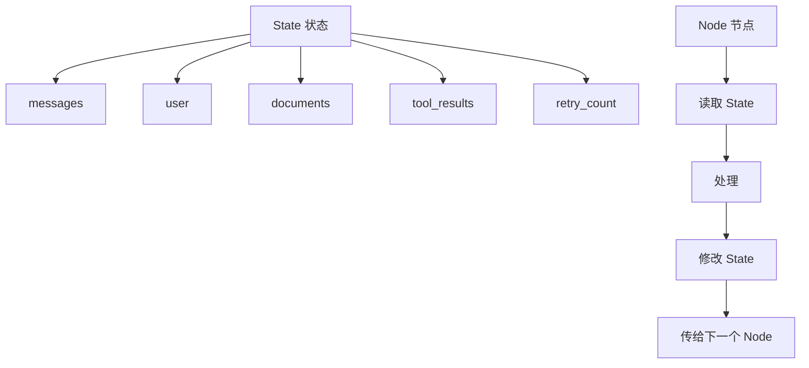

# State：为什么企业更相信可控的工作流，而不是完全自主的 Agent

为什么企业往往不喜欢让 LLM“完全自己决定下一步该做什么”？

## 核心要点

* LangGraph 中非常重要的概念是 State（状态），例如包含 messages、user、documents、tool_results、retry_count 等字段
* 每个 Node（节点）的工作模式是：读取 State → 处理 → 修改 State → 传给下一个 Node
* 这种基于状态的流程设计，比“让 LLM 无限自主决定下一步”要可靠得多
* 企业普遍偏好可控、可解释、可审计、可重现的系统，因此生产系统往往是“80% 确定性工作流 + 20% LLM 决策”的组合，而不是 100% 完全自主的 Agent

---

## 本章测验

本章共 5 道单项选择题。

### 第 1 题

LangGraph 中的 State 通常包含哪些内容？

- A. 只能包含用户的手机号码
- B. 只能包含服务器的 IP 地址
- C. messages、user、documents、tool_results、retry_count 等字段
- D. State 概念仅限于图片数据

选择答案后查看结果

正确答案：C

答案解析：本章给出的示例展示了 State 可以包含多种与任务相关的结构化字段。

### 第 2 题

每个 Node 处理 State 的基本模式是什么？

- A. 直接删除所有 State 数据后重新开始
- B. 忽略 State，仅依赖随机数生成结果
- C. State 只能被读取，不能被修改
- D. 读取 State → 处理 → 修改 State → 传给下一个 Node

选择答案后查看结果

正确答案：D

答案解析：本章明确描述了这一基本的状态流转模式。

### 第 3 题

本章认为基于 State 的流程设计相比“让 LLM 完全自主决定下一步”有什么优势？

- A. 可靠性更高，每一步的输入输出清晰可见，更容易排查问题
- B. 运行速度一定快十倍以上
- C. 完全不需要任何计算资源
- D. 可以完全消除所有系统错误

选择答案后查看结果

正确答案：A

答案解析：本章强调基于明确状态的流程更可预测、可控，便于问题排查。

### 第 4 题

本章提到企业普遍看重系统的哪些特性？

- A. 越复杂越好、越难理解越好
- B. 可控、可解释、可审计、可重现
- C. 越随机越好、越不可预测越好
- D. 只看重界面美观程度

选择答案后查看结果

正确答案：B

答案解析：本章明确列出了企业在生产系统中最看重的四个特性。

### 第 5 题

本章提到的生产系统经验法则是什么？

- A. 100% 依赖 LLM 自主决策，不设计任何确定性流程
- B. 100% 依赖固定规则，完全不使用 LLM
- C. 大约 80% 确定性工作流 + 20% LLM 决策，而非 100% 完全自主 Agent
- D. 50% 确定性流程与 50% 随机流程各占一半

选择答案后查看结果

正确答案：C

答案解析：本章给出了这一具体的经验法则，作为企业实践中的常见工程思维。

<!-- QUIZ_DATA_START
{
  "chapter": "19",
  "questions": [
    {
      "id": 1,
      "question": "LangGraph 中的 State 通常包含哪些内容？",
      "options": {
        "A": "只能包含用户的手机号码",
        "B": "只能包含服务器的 IP 地址",
        "C": "messages、user、documents、tool_results、retry_count 等字段",
        "D": "State 概念仅限于图片数据"
      },
      "answer": "C",
      "explanation": "本章给出的示例展示了 State 可以包含多种与任务相关的结构化字段。"
    },
    {
      "id": 2,
      "question": "每个 Node 处理 State 的基本模式是什么？",
      "options": {
        "A": "直接删除所有 State 数据后重新开始",
        "B": "忽略 State，仅依赖随机数生成结果",
        "C": "State 只能被读取，不能被修改",
        "D": "读取 State → 处理 → 修改 State → 传给下一个 Node"
      },
      "answer": "D",
      "explanation": "本章明确描述了这一基本的状态流转模式。"
    },
    {
      "id": 3,
      "question": "本章认为基于 State 的流程设计相比“让 LLM 完全自主决定下一步”有什么优势？",
      "options": {
        "A": "可靠性更高，每一步的输入输出清晰可见，更容易排查问题",
        "B": "运行速度一定快十倍以上",
        "C": "完全不需要任何计算资源",
        "D": "可以完全消除所有系统错误"
      },
      "answer": "A",
      "explanation": "本章强调基于明确状态的流程更可预测、可控，便于问题排查。"
    },
    {
      "id": 4,
      "question": "本章提到企业普遍看重系统的哪些特性？",
      "options": {
        "A": "越复杂越好、越难理解越好",
        "B": "可控、可解释、可审计、可重现",
        "C": "越随机越好、越不可预测越好",
        "D": "只看重界面美观程度"
      },
      "answer": "B",
      "explanation": "本章明确列出了企业在生产系统中最看重的四个特性。"
    },
    {
      "id": 5,
      "question": "本章提到的生产系统经验法则是什么？",
      "options": {
        "A": "100% 依赖 LLM 自主决策，不设计任何确定性流程",
        "B": "100% 依赖固定规则，完全不使用 LLM",
        "C": "大约 80% 确定性工作流 + 20% LLM 决策，而非 100% 完全自主 Agent",
        "D": "50% 确定性流程与 50% 随机流程各占一半"
      },
      "answer": "C",
      "explanation": "本章给出了这一具体的经验法则，作为企业实践中的常见工程思维。"
    }
  ]
}
QUIZ_DATA_END -->
