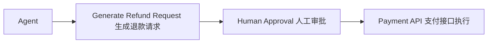

# Human-in-the-loop：不是所有决定都能交给 Agent 自动执行

如果 Agent 准备自动执行一笔 50 万元的退款，应该让它直接执行吗？

## 核心要点

* 对于高风险操作（如大额退款），Agent 不应直接自动执行，而应先生成请求，再经过人工审批
* 常见需要审批节点的操作类型包括：删除、转账、部署、发送邮件、退款、采购、修改生产环境
* LangGraph 提供的 interrupt、checkpoint、resume 等能力，是实现 Human-in-the-loop 的重要工程手段
* Human-in-the-loop 是企业 Agent 系统中平衡自动化效率与风险控制的关键设计

---

## 本章测验

本章共 5 道单项选择题。

### 第 1 题

面对一笔 50 万元的退款操作，本章建议 Agent 应该如何处理？

- A. 直接自动执行，无需任何审批
- B. 拒绝处理任何涉及金额的请求
- C. 交给另一个 Agent 随机决定是否执行
- D. 先生成退款请求，经过人工审批后再调用支付接口执行

选择答案后查看结果

正确答案：D

答案解析：本章明确指出高风险操作需要经过 Human Approval 环节，不能直接自动执行。

### 第 2 题

下列哪一组属于本章列举的、通常需要设置审批节点的高风险操作？

- A. 删除、转账、部署、发送邮件、退款、采购
- B. 查询天气、翻译文本、格式化日期
- C. 计算加法、生成随机数、显示当前时间
- D. 浏览网页标题、统计字数、拼写检查

选择答案后查看结果

正确答案：A

答案解析：这些是本章列举的、一旦出错代价较高、需要人工审批的操作类型。

### 第 3 题

LangGraph 中用于实现 Human-in-the-loop 的关键能力包括哪些？

- A. import、export、compile
- B. interrupt、checkpoint、resume
- C. start、stop、restart（操作系统级命令）
- D. insert、update、delete（纯 SQL 命令）

选择答案后查看结果

正确答案：B

答案解析：本章明确提到了这三个 LangGraph 提供的关键能力，用于支持暂停、保存状态和恢复执行。

### 第 4 题

在 Human-in-the-loop 流程中，checkpoint 的作用是什么？

- A. 直接删除所有已执行的操作记录
- B. 自动批准所有待审批的请求
- C. 保存当前的执行状态，以便后续能够从该点恢复执行
- D. 阻止用户查看任何执行日志

选择答案后查看结果

正确答案：C

答案解析：本章说明 checkpoint 用于保存流程执行到某一步时的状态，为后续 resume 提供基础。

### 第 5 题

本章认为 Human-in-the-loop 设计的本质目的是什么？

- A. 完全消除自动化，回归纯人工操作
- B. 完全消除人工干预，实现全自动化
- C. 仅仅是为了增加系统的复杂度
- D. 在自动化效率与风险控制之间找到平衡

选择答案后查看结果

正确答案：D

答案解析：本章总结指出这种设计是为了兼顾效率与风险控制，而非走向任何一个极端。

<!-- QUIZ_DATA_START
{
  "chapter": "20",
  "questions": [
    {
      "id": 1,
      "question": "面对一笔 50 万元的退款操作，本章建议 Agent 应该如何处理？",
      "options": {
        "A": "直接自动执行，无需任何审批",
        "B": "拒绝处理任何涉及金额的请求",
        "C": "交给另一个 Agent 随机决定是否执行",
        "D": "先生成退款请求，经过人工审批后再调用支付接口执行"
      },
      "answer": "D",
      "explanation": "本章明确指出高风险操作需要经过 Human Approval 环节，不能直接自动执行。"
    },
    {
      "id": 2,
      "question": "下列哪一组属于本章列举的、通常需要设置审批节点的高风险操作？",
      "options": {
        "A": "删除、转账、部署、发送邮件、退款、采购",
        "B": "查询天气、翻译文本、格式化日期",
        "C": "计算加法、生成随机数、显示当前时间",
        "D": "浏览网页标题、统计字数、拼写检查"
      },
      "answer": "A",
      "explanation": "这些是本章列举的、一旦出错代价较高、需要人工审批的操作类型。"
    },
    {
      "id": 3,
      "question": "LangGraph 中用于实现 Human-in-the-loop 的关键能力包括哪些？",
      "options": {
        "A": "import、export、compile",
        "B": "interrupt、checkpoint、resume",
        "C": "start、stop、restart（操作系统级命令）",
        "D": "insert、update、delete（纯 SQL 命令）"
      },
      "answer": "B",
      "explanation": "本章明确提到了这三个 LangGraph 提供的关键能力，用于支持暂停、保存状态和恢复执行。"
    },
    {
      "id": 4,
      "question": "在 Human-in-the-loop 流程中，checkpoint 的作用是什么？",
      "options": {
        "A": "直接删除所有已执行的操作记录",
        "B": "自动批准所有待审批的请求",
        "C": "保存当前的执行状态，以便后续能够从该点恢复执行",
        "D": "阻止用户查看任何执行日志"
      },
      "answer": "C",
      "explanation": "本章说明 checkpoint 用于保存流程执行到某一步时的状态，为后续 resume 提供基础。"
    },
    {
      "id": 5,
      "question": "本章认为 Human-in-the-loop 设计的本质目的是什么？",
      "options": {
        "A": "完全消除自动化，回归纯人工操作",
        "B": "完全消除人工干预，实现全自动化",
        "C": "仅仅是为了增加系统的复杂度",
        "D": "在自动化效率与风险控制之间找到平衡"
      },
      "answer": "D",
      "explanation": "本章总结指出这种设计是为了兼顾效率与风险控制，而非走向任何一个极端。"
    }
  ]
}
QUIZ_DATA_END -->
