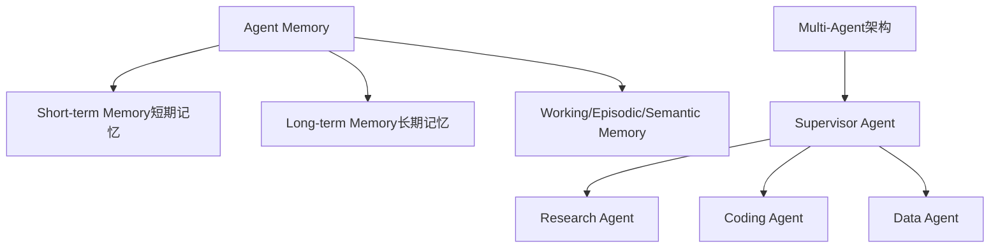

# Memory 与 Multi-Agent：不是越多越复杂就越高级

是不是把所有聊天记录都塞给 LLM，就是最好的“记忆”方案？

## 核心要点

* Agent Memory 可分为短期记忆（当前对话）与长期记忆（用户偏好、历史行为、任务状态），也可能涉及 Working Memory、Episodic Memory、Semantic Memory
* 企业系统不应简单粗暴地把所有聊天记录全部塞给 LLM，而应设计合理的记忆检索、摘要、元数据、过期、隐私机制
* Multi-Agent 架构（例如 Supervisor Agent 协调 Research/Coding/Data 等子 Agent，或 Planner→Researcher→Executor→Reviewer 流程）在特定场景下有价值
* 但 Multi-Agent 不是越多越高级，很多场景下“一个 Agent + 好的 Tools + 好的 Workflow”反而更稳定

---

## 本章测验

本章共 5 道单项选择题。

### 第 1 题

本章不建议的做法是什么？

- A. 把所有聊天记录全部粗暴地塞给 LLM 作为记忆
- B. 为记忆设计检索、摘要、元数据机制
- C. 区分短期记忆与长期记忆
- D. 考虑记忆数据的隐私问题

选择答案后查看结果

正确答案：A

答案解析：本章明确指出应避免将全部历史记录不加处理地全部输入模型，而应做合理的记忆管理。

### 第 2 题

下列哪一组属于本章提到的 Agent Memory 分类？

- A. 红色记忆、蓝色记忆、绿色记忆
- B. 短期记忆、长期记忆、Working/Episodic/Semantic Memory
- C. 上传记忆、下载记忆、缓存记忆
- D. 同步记忆、异步记忆、并发记忆

选择答案后查看结果

正确答案：B

答案解析：这些是本章列出的记忆类型划分。

### 第 3 题

关于 Multi-Agent 架构，本章的核心观点是什么？

- A. Agent 数量越多，系统性能一定越好
- B. Multi-Agent 架构在任何场景下都优于单 Agent 架构
- C. Multi-Agent 不是越多越高级，很多场景下单一 Agent 配合好工具和工作流反而更稳定
- D. Multi-Agent 完全没有实际应用价值

选择答案后查看结果

正确答案：C

答案解析：本章明确提出了这一反直觉但很重要的工程观点。

### 第 4 题

本章举例的 Multi-Agent 协调方式包括哪些？

- A. 所有 Agent 完全独立运行，互不通信
- B. 只能通过人工手动切换 Agent
- C. Multi-Agent 必须依赖区块链技术协调
- D. Supervisor Agent 协调子 Agent，或 Planner → Researcher → Executor → Reviewer 流程

选择答案后查看结果

正确答案：D

答案解析：本章列举了两种典型的 Multi-Agent 协作模式。

### 第 5 题

为什么本章建议企业系统的记忆设计需要考虑“过期”和“隐私”？

- A. 因为不加限制地保留和使用全部历史数据可能带来成本、干扰和隐私风险
- B. 因为过期和隐私与记忆设计完全无关
- C. 因为所有数据都应该永久保留，不设任何限制
- D. 因为隐私问题只在政府项目中才需要考虑

选择答案后查看结果

正确答案：A

答案解析：本章强调合理的记忆机制应包含过期和隐私考量，以避免不必要的风险和干扰。

<!-- QUIZ_DATA_START
{
  "chapter": "21",
  "questions": [
    {
      "id": 1,
      "question": "本章不建议的做法是什么？",
      "options": {
        "A": "把所有聊天记录全部粗暴地塞给 LLM 作为记忆",
        "B": "为记忆设计检索、摘要、元数据机制",
        "C": "区分短期记忆与长期记忆",
        "D": "考虑记忆数据的隐私问题"
      },
      "answer": "A",
      "explanation": "本章明确指出应避免将全部历史记录不加处理地全部输入模型，而应做合理的记忆管理。"
    },
    {
      "id": 2,
      "question": "下列哪一组属于本章提到的 Agent Memory 分类？",
      "options": {
        "A": "红色记忆、蓝色记忆、绿色记忆",
        "B": "短期记忆、长期记忆、Working/Episodic/Semantic Memory",
        "C": "上传记忆、下载记忆、缓存记忆",
        "D": "同步记忆、异步记忆、并发记忆"
      },
      "answer": "B",
      "explanation": "这些是本章列出的记忆类型划分。"
    },
    {
      "id": 3,
      "question": "关于 Multi-Agent 架构，本章的核心观点是什么？",
      "options": {
        "A": "Agent 数量越多，系统性能一定越好",
        "B": "Multi-Agent 架构在任何场景下都优于单 Agent 架构",
        "C": "Multi-Agent 不是越多越高级，很多场景下单一 Agent 配合好工具和工作流反而更稳定",
        "D": "Multi-Agent 完全没有实际应用价值"
      },
      "answer": "C",
      "explanation": "本章明确提出了这一反直觉但很重要的工程观点。"
    },
    {
      "id": 4,
      "question": "本章举例的 Multi-Agent 协调方式包括哪些？",
      "options": {
        "A": "所有 Agent 完全独立运行，互不通信",
        "B": "只能通过人工手动切换 Agent",
        "C": "Multi-Agent 必须依赖区块链技术协调",
        "D": "Supervisor Agent 协调子 Agent，或 Planner → Researcher → Executor → Reviewer 流程"
      },
      "answer": "D",
      "explanation": "本章列举了两种典型的 Multi-Agent 协作模式。"
    },
    {
      "id": 5,
      "question": "为什么本章建议企业系统的记忆设计需要考虑“过期”和“隐私”？",
      "options": {
        "A": "因为不加限制地保留和使用全部历史数据可能带来成本、干扰和隐私风险",
        "B": "因为过期和隐私与记忆设计完全无关",
        "C": "因为所有数据都应该永久保留，不设任何限制",
        "D": "因为隐私问题只在政府项目中才需要考虑"
      },
      "answer": "A",
      "explanation": "本章强调合理的记忆机制应包含过期和隐私考量，以避免不必要的风险和干扰。"
    }
  ]
}
QUIZ_DATA_END -->
