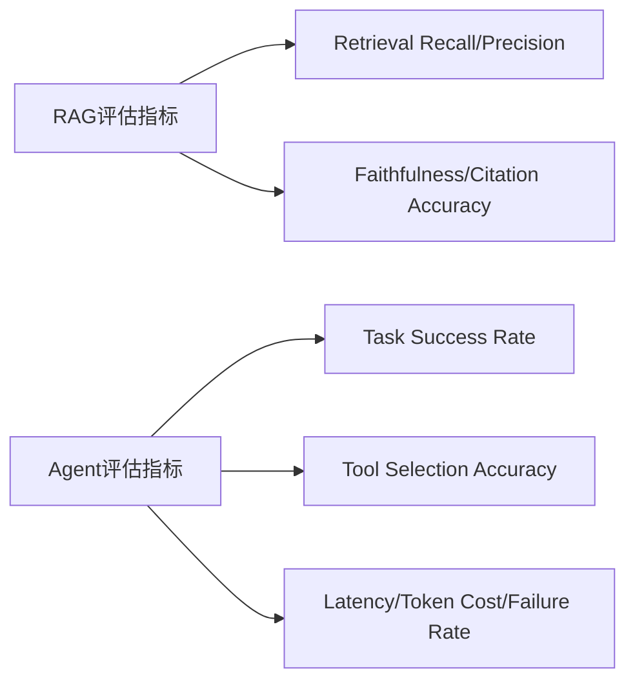

# Eval：从“感觉挺聪明”到真正可衡量的质量

做 Demo 时说“感觉AI挺聪明”是可以接受的，但做企业系统时，这句话够用吗？

## 核心要点

* 做 Demo 时“感觉挺聪明”可以接受，但做企业 AI 系统必须能回答“AI到底有多好”这个问题
* RAG 评估指标包括：Retrieval Recall、Precision、MRR、NDCG、Context Relevance、Answer Correctness、Faithfulness、Citation Accuracy
* Agent 评估指标包括：Task Success Rate、Tool Selection Accuracy、Tool Execution Success、Steps per Task、Latency、Token Cost、Failure Rate
* 根据行业调研，质量已经成为 Agent 生产化的头号障碍之一：约 89% 的受访者已采用 observability，但真正采用 evals 的只有约一半，这说明 Eval 是很有价值但仍被低估的工程能力

---

## 本章测验

本章共 5 道单项选择题。

### 第 1 题

本章认为“做 Demo”和“做企业 AI 系统”在评估要求上的核心差异是什么？

- A. 企业系统完全不需要任何评估
- B. 企业系统必须能用具体指标回答“AI 到底有多好”，而不能只是主观感受
- C. Demo 阶段的评估要求比企业系统更严格
- D. 两者的评估要求完全相同，没有任何差异

选择答案后查看结果

正确答案：B

答案解析：本章明确指出企业级系统需要可衡量的评估体系，而不能停留在“感觉挺聪明”的主观层面。

### 第 2 题

下列哪一组属于本章列出的 RAG 评估指标？

- A. CPU 使用率、内存占用率、磁盘 IO
- B. 页面加载时间、点击率、跳出率
- C. Retrieval Recall、Precision、Faithfulness、Citation Accuracy
- D. 股票价格、汇率、通货膨胀率

选择答案后查看结果

正确答案：C

答案解析：这些是本章明确列出的 RAG 系统评估指标。

### 第 3 题

下列哪一组属于本章列出的 Agent 评估指标？

- A. 页面配色方案、字体大小、按钮圆角
- B. 员工满意度调查结果
- C. 公司股价涨跌幅
- D. Task Success Rate、Tool Selection Accuracy、Latency、Token Cost

选择答案后查看结果

正确答案：D

答案解析：这些是本章明确列出的 Agent 系统评估指标。

### 第 4 题

根据本章引用的行业调研，observability 和 evals 的采用情况分别是怎样的？

- A. 约 89% 采用了 observability，但真正采用 evals 的只有约一半
- B. 两者的采用率都接近 100%
- C. 两者的采用率都接近 0%
- D. evals 的采用率远高于 observability

选择答案后查看结果

正确答案：A

答案解析：本章引用的调研数据显示两者之间存在明显差距，evals 的采用率明显更低。

### 第 5 题

本章认为这一采用率差距说明了什么？

- A. 说明 observability 和 evals 完全是同一件事，没有区别
- B. 很多团队已具备“看到”系统运行情况的能力，但尚未建立“衡量”系统好坏的能力，这正是 Eval 的价值所在
- C. 说明 Eval 已经过时，不再有实际价值
- D. 说明企业普遍不关心 AI 系统的质量问题

选择答案后查看结果

正确答案：B

答案解析：本章将这一差距解读为 Eval 能力被低估但极具价值的信号。

<!-- QUIZ_DATA_START
{
  "chapter": "22",
  "questions": [
    {
      "id": 1,
      "question": "本章认为“做 Demo”和“做企业 AI 系统”在评估要求上的核心差异是什么？",
      "options": {
        "A": "企业系统完全不需要任何评估",
        "B": "企业系统必须能用具体指标回答“AI 到底有多好”，而不能只是主观感受",
        "C": "Demo 阶段的评估要求比企业系统更严格",
        "D": "两者的评估要求完全相同，没有任何差异"
      },
      "answer": "B",
      "explanation": "本章明确指出企业级系统需要可衡量的评估体系，而不能停留在“感觉挺聪明”的主观层面。"
    },
    {
      "id": 2,
      "question": "下列哪一组属于本章列出的 RAG 评估指标？",
      "options": {
        "A": "CPU 使用率、内存占用率、磁盘 IO",
        "B": "页面加载时间、点击率、跳出率",
        "C": "Retrieval Recall、Precision、Faithfulness、Citation Accuracy",
        "D": "股票价格、汇率、通货膨胀率"
      },
      "answer": "C",
      "explanation": "这些是本章明确列出的 RAG 系统评估指标。"
    },
    {
      "id": 3,
      "question": "下列哪一组属于本章列出的 Agent 评估指标？",
      "options": {
        "A": "页面配色方案、字体大小、按钮圆角",
        "B": "员工满意度调查结果",
        "C": "公司股价涨跌幅",
        "D": "Task Success Rate、Tool Selection Accuracy、Latency、Token Cost"
      },
      "answer": "D",
      "explanation": "这些是本章明确列出的 Agent 系统评估指标。"
    },
    {
      "id": 4,
      "question": "根据本章引用的行业调研，observability 和 evals 的采用情况分别是怎样的？",
      "options": {
        "A": "约 89% 采用了 observability，但真正采用 evals 的只有约一半",
        "B": "两者的采用率都接近 100%",
        "C": "两者的采用率都接近 0%",
        "D": "evals 的采用率远高于 observability"
      },
      "answer": "A",
      "explanation": "本章引用的调研数据显示两者之间存在明显差距，evals 的采用率明显更低。"
    },
    {
      "id": 5,
      "question": "本章认为这一采用率差距说明了什么？",
      "options": {
        "A": "说明 observability 和 evals 完全是同一件事，没有区别",
        "B": "很多团队已具备“看到”系统运行情况的能力，但尚未建立“衡量”系统好坏的能力，这正是 Eval 的价值所在",
        "C": "说明 Eval 已经过时，不再有实际价值",
        "D": "说明企业普遍不关心 AI 系统的质量问题"
      },
      "answer": "B",
      "explanation": "本章将这一差距解读为 Eval 能力被低估但极具价值的信号。"
    }
  ]
}
QUIZ_DATA_END -->
