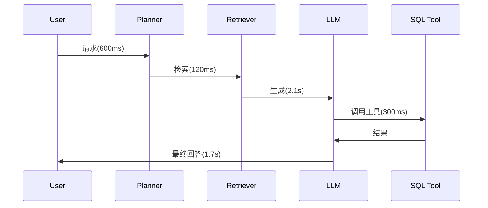

# Observability：找到 Agent 系统真正的瓶颈在哪里

传统软件看 CPU、内存、日志就够了，Agent 系统还需要额外关注什么？

## 核心要点

* 传统软件的可观测性关注 CPU、内存、日志、异常，而 Agent 系统还需要额外关注 Prompt、Model、Token、Tool Calls、Retrieval、Agent Trace、Latency、Cost、Errors
* 常用可观测性工具包括 LangSmith、OpenTelemetry、Phoenix、Langfuse、Datadog 等
* Agent Trace（执行轨迹）可以清晰展示每个环节（如 Planner、Retriever、LLM、Tool）各自耗时多少
* 只有具备完整的 Agent Trace，才能准确定位系统的性能瓶颈和问题根源

---

## 本章测验

本章共 5 道单项选择题。

### 第 1 题

相比传统软件，Agent 系统的可观测性需要额外关注哪些内容？

- A. 只需要关注屏幕分辨率和字体大小
- B. 只需要关注用户的鼠标点击位置
- C. Prompt、Model、Token、Tool Calls、Retrieval、Agent Trace、Latency、Cost
- D. 完全不需要额外关注任何新维度

选择答案后查看结果

正确答案：C

答案解析：本章明确列出了 Agent 系统相较传统软件需要额外监控的独特维度。

### 第 2 题

在本章给出的 Agent Trace 时序图例子中，哪个环节耗时最长？

- A. Planner 阶段（600 毫秒）
- B. Retriever 检索阶段（120 毫秒）
- C. SQL 工具调用阶段（300 毫秒）
- D. LLM 生成阶段（2.1 秒）

选择答案后查看结果

正确答案：D

答案解析：根据时序图中标注的耗时，LLM 生成阶段的 2.1 秒是所有环节中最长的。

### 第 3 题

下列哪一组属于本章列举的 Agent 可观测性工具？

- A. LangSmith、OpenTelemetry、Phoenix、Langfuse、Datadog
- B. Photoshop、Illustrator、Figma
- C. Excel、PowerPoint、Word
- D. Chrome、Firefox、Safari

选择答案后查看结果

正确答案：A

答案解析：这些是本章明确列举的可观测性相关工具。

### 第 4 题

为什么本章强调需要细粒度的 Agent Trace 数据？

- A. 因为细粒度数据可以自动修复所有系统错误
- B. 因为只有细粒度追踪才能准确定位问题具体出现在哪个环节
- C. 因为细粒度数据只是为了让日志文件看起来更大
- D. 因为这是法律强制要求的合规内容

选择答案后查看结果

正确答案：B

答案解析：本章指出没有细粒度追踪数据，就无法判断问题出在检索、模型调用还是其他环节。

### 第 5 题

如果发现 LLM 调用是整个流程中最大的耗时来源，本章建议的优化方向是什么？

- A. 完全放弃使用 LLM，改用规则引擎
- B. 增加更多不必要的 LLM 调用以分散耗时
- C. 减少不必要的 LLM 调用次数，或优化 Prompt 长度
- D. 忽略这个问题，因为耗时无法优化

选择答案后查看结果

正确答案：C

答案解析：本章基于示例数据提出了具体的优化方向建议，即针对最大耗时环节进行有针对性的优化。

<!-- QUIZ_DATA_START
{
  "chapter": "23",
  "questions": [
    {
      "id": 1,
      "question": "相比传统软件，Agent 系统的可观测性需要额外关注哪些内容？",
      "options": {
        "A": "只需要关注屏幕分辨率和字体大小",
        "B": "只需要关注用户的鼠标点击位置",
        "C": "Prompt、Model、Token、Tool Calls、Retrieval、Agent Trace、Latency、Cost",
        "D": "完全不需要额外关注任何新维度"
      },
      "answer": "C",
      "explanation": "本章明确列出了 Agent 系统相较传统软件需要额外监控的独特维度。"
    },
    {
      "id": 2,
      "question": "在本章给出的 Agent Trace 时序图例子中，哪个环节耗时最长？",
      "options": {
        "A": "Planner 阶段（600 毫秒）",
        "B": "Retriever 检索阶段（120 毫秒）",
        "C": "SQL 工具调用阶段（300 毫秒）",
        "D": "LLM 生成阶段（2.1 秒）"
      },
      "answer": "D",
      "explanation": "根据时序图中标注的耗时，LLM 生成阶段的 2.1 秒是所有环节中最长的。"
    },
    {
      "id": 3,
      "question": "下列哪一组属于本章列举的 Agent 可观测性工具？",
      "options": {
        "A": "LangSmith、OpenTelemetry、Phoenix、Langfuse、Datadog",
        "B": "Photoshop、Illustrator、Figma",
        "C": "Excel、PowerPoint、Word",
        "D": "Chrome、Firefox、Safari"
      },
      "answer": "A",
      "explanation": "这些是本章明确列举的可观测性相关工具。"
    },
    {
      "id": 4,
      "question": "为什么本章强调需要细粒度的 Agent Trace 数据？",
      "options": {
        "A": "因为细粒度数据可以自动修复所有系统错误",
        "B": "因为只有细粒度追踪才能准确定位问题具体出现在哪个环节",
        "C": "因为细粒度数据只是为了让日志文件看起来更大",
        "D": "因为这是法律强制要求的合规内容"
      },
      "answer": "B",
      "explanation": "本章指出没有细粒度追踪数据，就无法判断问题出在检索、模型调用还是其他环节。"
    },
    {
      "id": 5,
      "question": "如果发现 LLM 调用是整个流程中最大的耗时来源，本章建议的优化方向是什么？",
      "options": {
        "A": "完全放弃使用 LLM，改用规则引擎",
        "B": "增加更多不必要的 LLM 调用以分散耗时",
        "C": "减少不必要的 LLM 调用次数，或优化 Prompt 长度",
        "D": "忽略这个问题，因为耗时无法优化"
      },
      "answer": "C",
      "explanation": "本章基于示例数据提出了具体的优化方向建议，即针对最大耗时环节进行有针对性的优化。"
    }
  ]
}
QUIZ_DATA_END -->
