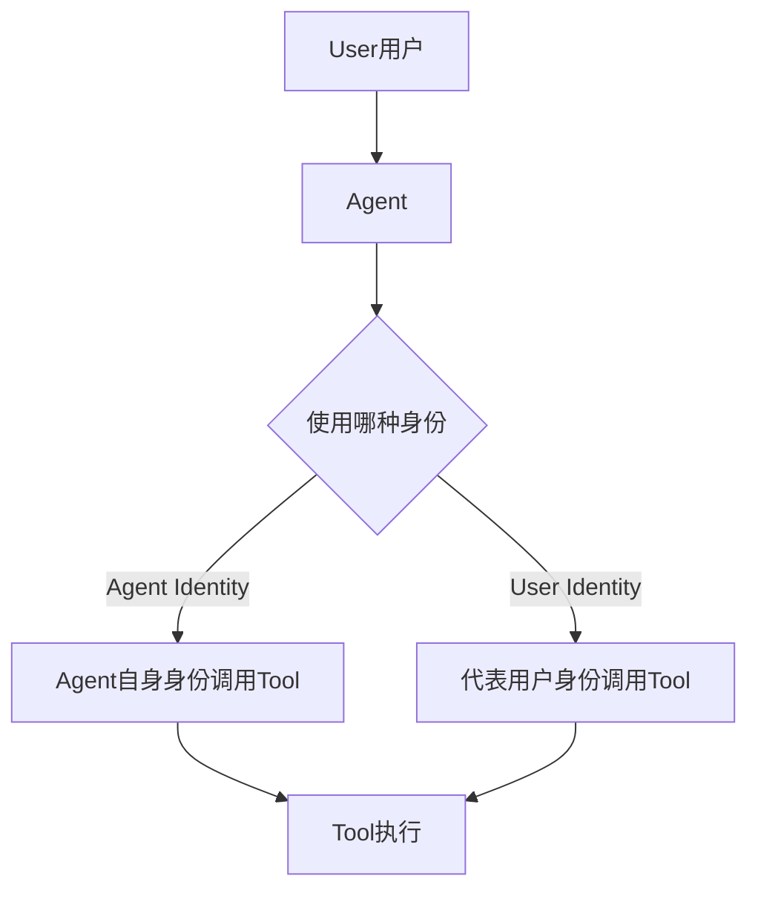

# IAM：Agent 调用工具时，到底用谁的身份？

当 Agent 代表用户去查询一份文件时，它应该用“自己的身份”还是“用户的身份”？

## 核心要点

* 企业 IAM 相关的核心知识包括 OAuth2、OIDC、SSO、SAML、RBAC、ABAC、Secrets Management、KMS、IAM 本身
* Agent 调用 Tool 时存在一个非常重要的架构问题：到底应该使用 Agent Identity（Agent 自身身份），还是 User Identity（代表用户的身份）
* 这个选择直接决定了权限边界：用 Agent 身份可能导致权限过大，用用户身份则需要更复杂的委托授权机制
* MCP 目前正专门加强 enterprise-managed authorization 和 agent identity，正是因为这已经成为 Agent 进入企业后的核心问题

---

## 本章测验

本章共 5 道单项选择题。

### 第 1 题

本章讨论的核心架构问题是什么？

- A. Agent 调用 Tool 时应该使用 Agent Identity 还是 User Identity
- B. Agent 应该使用哪种编程语言编写
- C. Agent 应该部署在哪个云厂商
- D. Agent 应该使用哪种向量数据库

选择答案后查看结果

正确答案：A

答案解析：本章聚焦于身份使用方式的架构决策问题，这是企业 Agent 系统设计中的核心难题之一。

### 第 2 题

如果 Agent 使用自身的 Agent Identity 调用工具，可能带来什么风险？

- A. 系统运行速度会变得极其缓慢
- B. 如果权限设置过大，可能导致用户越权访问本不该看到的数据
- C. Agent 将完全无法调用任何工具
- D. 会自动触发系统崩溃

选择答案后查看结果

正确答案：B

答案解析：本章指出使用 Agent 自身身份虽然实现简单，但存在权限过大导致越权访问的风险。

### 第 3 题

下列哪一组属于本章列举的企业 IAM 相关基础知识？

- A. HTML、CSS、JavaScript
- B. TCP、UDP、ICMP
- C. OAuth2、OIDC、SSO、SAML、RBAC、ABAC、KMS
- D. JPEG、PNG、GIF

选择答案后查看结果

正确答案：C

答案解析：这些是本章明确列举的企业身份与权限管理相关的核心知识点。

### 第 4 题

为什么 MCP 目前专门在加强 enterprise-managed authorization 和 agent identity 相关能力？

- A. 因为这与企业实际需求完全无关，只是技术炒作
- B. 因为这只是为了让协议文档看起来更完整
- C. 因为这与安全问题毫无关联
- D. 因为 Agent 真正进入企业生产环境后，“用什么身份做事”已成为核心问题

选择答案后查看结果

正确答案：D

答案解析：本章说明这一发展方向直接回应了企业 Agent 落地过程中身份与权限管理的实际需求。

### 第 5 题

本章认为身份与权限设计对企业采用 Agent 系统有何影响？

- A. 如果处理不好，即使功能强大，企业安全团队也很难放心接入生产环境
- B. 身份与权限设计与企业是否采用 Agent 系统完全无关
- C. 只要功能足够强大，企业就会忽略所有安全隐患
- D. 企业普遍不关心身份和权限问题

选择答案后查看结果

正确答案：A

答案解析：本章总结指出身份权限设计是决定企业能否信任并采用 Agent 系统的关键因素之一。

<!-- QUIZ_DATA_START
{
  "chapter": "25",
  "questions": [
    {
      "id": 1,
      "question": "本章讨论的核心架构问题是什么？",
      "options": {
        "A": "Agent 调用 Tool 时应该使用 Agent Identity 还是 User Identity",
        "B": "Agent 应该使用哪种编程语言编写",
        "C": "Agent 应该部署在哪个云厂商",
        "D": "Agent 应该使用哪种向量数据库"
      },
      "answer": "A",
      "explanation": "本章聚焦于身份使用方式的架构决策问题，这是企业 Agent 系统设计中的核心难题之一。"
    },
    {
      "id": 2,
      "question": "如果 Agent 使用自身的 Agent Identity 调用工具，可能带来什么风险？",
      "options": {
        "A": "系统运行速度会变得极其缓慢",
        "B": "如果权限设置过大，可能导致用户越权访问本不该看到的数据",
        "C": "Agent 将完全无法调用任何工具",
        "D": "会自动触发系统崩溃"
      },
      "answer": "B",
      "explanation": "本章指出使用 Agent 自身身份虽然实现简单，但存在权限过大导致越权访问的风险。"
    },
    {
      "id": 3,
      "question": "下列哪一组属于本章列举的企业 IAM 相关基础知识？",
      "options": {
        "A": "HTML、CSS、JavaScript",
        "B": "TCP、UDP、ICMP",
        "C": "OAuth2、OIDC、SSO、SAML、RBAC、ABAC、KMS",
        "D": "JPEG、PNG、GIF"
      },
      "answer": "C",
      "explanation": "这些是本章明确列举的企业身份与权限管理相关的核心知识点。"
    },
    {
      "id": 4,
      "question": "为什么 MCP 目前专门在加强 enterprise-managed authorization 和 agent identity 相关能力？",
      "options": {
        "A": "因为这与企业实际需求完全无关，只是技术炒作",
        "B": "因为这只是为了让协议文档看起来更完整",
        "C": "因为这与安全问题毫无关联",
        "D": "因为 Agent 真正进入企业生产环境后，“用什么身份做事”已成为核心问题"
      },
      "answer": "D",
      "explanation": "本章说明这一发展方向直接回应了企业 Agent 落地过程中身份与权限管理的实际需求。"
    },
    {
      "id": 5,
      "question": "本章认为身份与权限设计对企业采用 Agent 系统有何影响？",
      "options": {
        "A": "如果处理不好，即使功能强大，企业安全团队也很难放心接入生产环境",
        "B": "身份与权限设计与企业是否采用 Agent 系统完全无关",
        "C": "只要功能足够强大，企业就会忽略所有安全隐患",
        "D": "企业普遍不关心身份和权限问题"
      },
      "answer": "A",
      "explanation": "本章总结指出身份权限设计是决定企业能否信任并采用 Agent 系统的关键因素之一。"
    }
  ]
}
QUIZ_DATA_END -->
