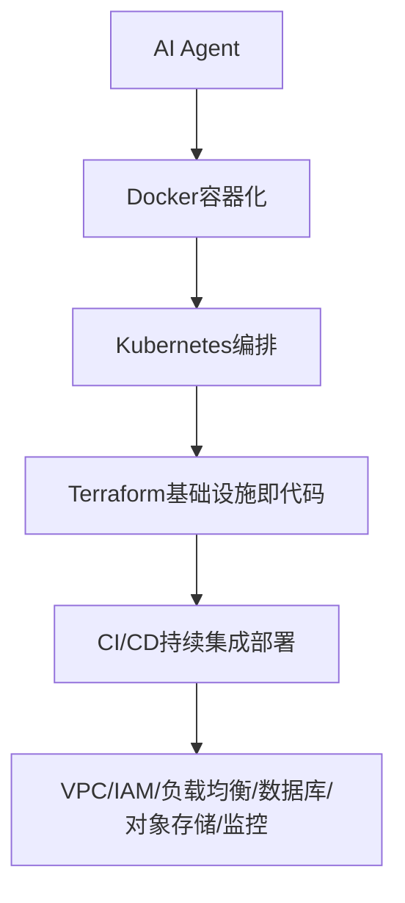

# AI Agent 最后还是一个软件系统：Cloud 与 Infrastructure

即使 Agent 再智能，它最终还是要跑在某台服务器、某个集群上，这部分能力可以跳过吗？

## 核心要点

* FDE 通常不能只懂 AI，至少应掌握一个云平台，例如 AWS、Azure 或 GCP
* 关键基础设施技能包括 Docker、Kubernetes、Terraform、CI/CD、VPC、IAM、负载均衡、数据库、对象存储、密钥管理、监控
* 企业招聘 FDE 岗位时，往往直接要求 AWS/Azure、Kubernetes、Terraform 等基础设施经验
* 核心原则：AI Agent 最后还是软件系统，脱离基础设施能力，再智能的 Agent 也无法稳定运行在生产环境中

---

## 本章测验

本章共 5 道单项选择题。

### 第 1 题

本章提出的核心原则是什么？

- A. AI Agent 完全不需要任何服务器资源
- B. AI Agent 最后还是软件系统，离不开基础设施能力的支撑
- C. 基础设施问题应该完全交给客户自行解决
- D. Agent 的智能程度决定了它不需要基础设施

选择答案后查看结果

正确答案：B

答案解析：本章标题和内容都强调 Agent 本质上仍是运行在基础设施之上的软件系统。

### 第 2 题

本章建议 FDE 至少应该掌握以下哪一类云平台？

- A. 只能使用国产云服务，不能使用任何国际云平台
- B. 完全不需要掌握任何云平台
- C. AWS、Azure 或 GCP 中的至少一个
- D. 必须同时精通所有主流云平台

选择答案后查看结果

正确答案：C

答案解析：本章建议至少掌握一个主流云平台，而非要求全部精通或完全不学。

### 第 3 题

下列哪一组属于本章列举的核心基础设施技能？

- A. Photoshop、Illustrator、Sketch
- B. Excel 公式、数据透视表、宏录制
- C. PPT 动画效果、模板设计
- D. Docker、Kubernetes、Terraform、CI/CD

选择答案后查看结果

正确答案：D

答案解析：这些是本章明确列举的企业级基础设施相关核心技能。

### 第 4 题

本章提到企业在招聘 FDE 时，通常会如何要求基础设施相关经验？

- A. 直接要求具备 AWS/Azure、Kubernetes、Terraform 等实际经验
- B. 完全不关心候选人是否了解基础设施
- C. 只关心候选人是否会画架构图，不要求实操经验
- D. 只要求了解基础设施的历史发展

选择答案后查看结果

正确答案：A

答案解析：本章明确提到企业招聘描述中直接列出了这些基础设施相关的硬性要求。

### 第 5 题

本章认为缺乏基础设施能力会给 Agent 项目带来什么后果？

- A. 完全不会有任何负面影响
- B. 即使原型再智能，也无法稳定部署、扩展和维护，只能停留在演示阶段
- C. 只会影响系统的界面美观程度
- D. 只会略微增加项目成本，不影响功能

选择答案后查看结果

正确答案：B

答案解析：本章总结指出基础设施能力的缺失会直接限制 Agent 从原型走向生产的能力。

<!-- QUIZ_DATA_START
{
  "chapter": "26",
  "questions": [
    {
      "id": 1,
      "question": "本章提出的核心原则是什么？",
      "options": {
        "A": "AI Agent 完全不需要任何服务器资源",
        "B": "AI Agent 最后还是软件系统，离不开基础设施能力的支撑",
        "C": "基础设施问题应该完全交给客户自行解决",
        "D": "Agent 的智能程度决定了它不需要基础设施"
      },
      "answer": "B",
      "explanation": "本章标题和内容都强调 Agent 本质上仍是运行在基础设施之上的软件系统。"
    },
    {
      "id": 2,
      "question": "本章建议 FDE 至少应该掌握以下哪一类云平台？",
      "options": {
        "A": "只能使用国产云服务，不能使用任何国际云平台",
        "B": "完全不需要掌握任何云平台",
        "C": "AWS、Azure 或 GCP 中的至少一个",
        "D": "必须同时精通所有主流云平台"
      },
      "answer": "C",
      "explanation": "本章建议至少掌握一个主流云平台，而非要求全部精通或完全不学。"
    },
    {
      "id": 3,
      "question": "下列哪一组属于本章列举的核心基础设施技能？",
      "options": {
        "A": "Photoshop、Illustrator、Sketch",
        "B": "Excel 公式、数据透视表、宏录制",
        "C": "PPT 动画效果、模板设计",
        "D": "Docker、Kubernetes、Terraform、CI/CD"
      },
      "answer": "D",
      "explanation": "这些是本章明确列举的企业级基础设施相关核心技能。"
    },
    {
      "id": 4,
      "question": "本章提到企业在招聘 FDE 时，通常会如何要求基础设施相关经验？",
      "options": {
        "A": "直接要求具备 AWS/Azure、Kubernetes、Terraform 等实际经验",
        "B": "完全不关心候选人是否了解基础设施",
        "C": "只关心候选人是否会画架构图，不要求实操经验",
        "D": "只要求了解基础设施的历史发展"
      },
      "answer": "A",
      "explanation": "本章明确提到企业招聘描述中直接列出了这些基础设施相关的硬性要求。"
    },
    {
      "id": 5,
      "question": "本章认为缺乏基础设施能力会给 Agent 项目带来什么后果？",
      "options": {
        "A": "完全不会有任何负面影响",
        "B": "即使原型再智能，也无法稳定部署、扩展和维护，只能停留在演示阶段",
        "C": "只会影响系统的界面美观程度",
        "D": "只会略微增加项目成本，不影响功能"
      },
      "answer": "B",
      "explanation": "本章总结指出基础设施能力的缺失会直接限制 Agent 从原型走向生产的能力。"
    }
  ]
}
QUIZ_DATA_END -->
