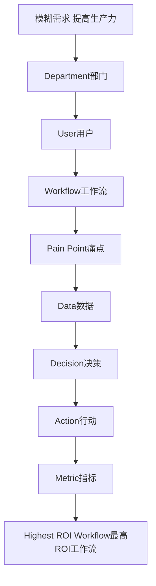

# 比 LangChain 更重要的能力：Business Discovery 与 ROI

客户说“我们想用生成式AI提高生产力”，这句话本身能直接指导任何技术工作吗？

## 核心要点

* 客户常见的模糊需求（例如“想用AI提高生产力”）几乎不包含任何可直接执行的技术信息，需要 FDE 拆解
* 拆解路径：部门 → 用户 → 工作流 → 痛点 → 数据 → 决策 → 行动 → 指标，最终定位到 Highest ROI Workflow（最高投资回报率的工作流）
* ROI 计算的基本框架：Before（现状）→ After（改善后）→ Time Saved（节省时间）→ Money Saved（节省成本）→ Revenue Increased（收入提升）→ Risk Reduced（风险降低）
* 举例：500名客服，每人每天查资料耗时1小时，AI帮助将其压缩到15分钟，节省的45分钟乘以500人，就是企业愿意为AI项目投入预算的依据

---

## 本章测验

本章共 5 道单项选择题。

### 第 1 题

面对“我们想用生成式AI提高生产力”这类模糊需求，FDE 应该做什么？

- A. 立刻选定一个大模型开始训练
- B. 直接告诉客户这个需求无法实现
- C. 按照部门→用户→工作流→痛点→数据→决策→行动→指标的路径逐步拆解
- D. 跳过需求分析，直接进入编码阶段

选择答案后查看结果

正确答案：C

答案解析：本章明确给出了拆解模糊需求的具体路径，这是 FDE 的核心能力之一。

### 第 2 题

拆解模糊需求的最终目标是什么？

- A. 尽可能多地列出所有可能的工作流而不做优先级排序
- B. 证明客户的需求本身是错误的
- C. 让项目范围尽可能扩大以增加工作量
- D. 找到 Highest ROI Workflow，即投资回报率最高的工作流

选择答案后查看结果

正确答案：D

答案解析：本章强调拆解的目的是聚焦到最有价值的工作流，而非泛泛列举。

### 第 3 题

本章给出的 ROI 计算基本框架是什么？

- A. Before → After → Time Saved → Money Saved → Revenue Increased → Risk Reduced
- B. Input → Output → Debug → Deploy
- C. Plan → Design → Build → Test
- D. Login → Query → Logout

选择答案后查看结果

正确答案：A

答案解析：这是本章明确给出的 ROI 计算思路框架。

### 第 4 题

在本章的客服案例中，500名客服每人每天节省45分钟，这个数字最终用来说明什么？

- A. 客服人员每天的工作时长上限
- B. 企业愿意为AI项目投入预算的量化依据
- C. AI系统的最大并发处理能力
- D. 客服部门的员工满意度

选择答案后查看结果

正确答案：B

答案解析：本章用这个例子说明如何将节省的时间转化为具体的金钱价值，作为投资决策依据。

### 第 5 题

本章如何评价“模糊问题拆解能力”和“ROI计算能力”相对于具体技术框架（如 LangChain）的重要性？

- A. 这类能力完全不重要，纯技术能力才是唯一关键
- B. 两者同等重要，没有任何侧重
- C. 这类业务能力甚至比精通某个具体技术框架更加重要
- D. 技术框架的重要性远高于业务拆解能力

选择答案后查看结果

正确答案：C

答案解析：本章明确指出这种偏向产品经理和商业分析的能力，其重要性甚至超过某个具体框架的掌握程度。

<!-- QUIZ_DATA_START
{
  "chapter": "27",
  "questions": [
    {
      "id": 1,
      "question": "面对“我们想用生成式AI提高生产力”这类模糊需求，FDE 应该做什么？",
      "options": {
        "A": "立刻选定一个大模型开始训练",
        "B": "直接告诉客户这个需求无法实现",
        "C": "按照部门→用户→工作流→痛点→数据→决策→行动→指标的路径逐步拆解",
        "D": "跳过需求分析，直接进入编码阶段"
      },
      "answer": "C",
      "explanation": "本章明确给出了拆解模糊需求的具体路径，这是 FDE 的核心能力之一。"
    },
    {
      "id": 2,
      "question": "拆解模糊需求的最终目标是什么？",
      "options": {
        "A": "尽可能多地列出所有可能的工作流而不做优先级排序",
        "B": "证明客户的需求本身是错误的",
        "C": "让项目范围尽可能扩大以增加工作量",
        "D": "找到 Highest ROI Workflow，即投资回报率最高的工作流"
      },
      "answer": "D",
      "explanation": "本章强调拆解的目的是聚焦到最有价值的工作流，而非泛泛列举。"
    },
    {
      "id": 3,
      "question": "本章给出的 ROI 计算基本框架是什么？",
      "options": {
        "A": "Before → After → Time Saved → Money Saved → Revenue Increased → Risk Reduced",
        "B": "Input → Output → Debug → Deploy",
        "C": "Plan → Design → Build → Test",
        "D": "Login → Query → Logout"
      },
      "answer": "A",
      "explanation": "这是本章明确给出的 ROI 计算思路框架。"
    },
    {
      "id": 4,
      "question": "在本章的客服案例中，500名客服每人每天节省45分钟，这个数字最终用来说明什么？",
      "options": {
        "A": "客服人员每天的工作时长上限",
        "B": "企业愿意为AI项目投入预算的量化依据",
        "C": "AI系统的最大并发处理能力",
        "D": "客服部门的员工满意度"
      },
      "answer": "B",
      "explanation": "本章用这个例子说明如何将节省的时间转化为具体的金钱价值，作为投资决策依据。"
    },
    {
      "id": 5,
      "question": "本章如何评价“模糊问题拆解能力”和“ROI计算能力”相对于具体技术框架（如 LangChain）的重要性？",
      "options": {
        "A": "这类能力完全不重要，纯技术能力才是唯一关键",
        "B": "两者同等重要，没有任何侧重",
        "C": "这类业务能力甚至比精通某个具体技术框架更加重要",
        "D": "技术框架的重要性远高于业务拆解能力"
      },
      "answer": "C",
      "explanation": "本章明确指出这种偏向产品经理和商业分析的能力，其重要性甚至超过某个具体框架的掌握程度。"
    }
  ]
}
QUIZ_DATA_END -->
