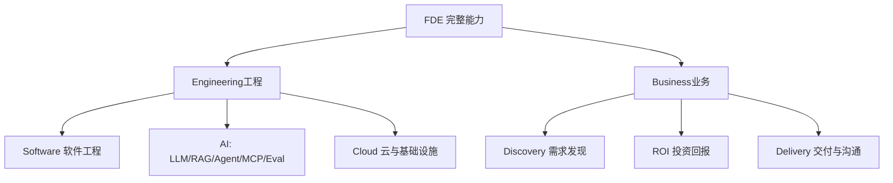

# 总结：FDE 完整能力地图，以及从这里出发的实战路线

把前面27章串起来看，一个真正合格的 FDE，到底应该具备什么样的完整画像？

## 核心要点

* FDE 的完整能力地图可以归纳为两大分支：Engineering（工程）与 Business（业务）
* Engineering 分支涵盖软件工程基础、LLM/RAG/Agent/MCP/Eval 等 AI 技术栈，以及 Cloud/基础设施能力
* Business 分支涵盖 Discovery 需求发现、ROI 投资回报计算，以及沟通、咨询、项目管理等交付能力
* 建议的技能优先级：Python、软件工程、LLM API、Tool Calling、RAG、Business Discovery、Agent Workflow、Evaluation 为最高优先级；LangGraph、MCP、Security、Cloud、SQL、Vector DB 次之；LangChain、本地大模型、Kubernetes、Terraform、Multi-Agent 再次之；模型训练和微调优先级最低
* 一个值得投入的练习项目是搭建一个 Enterprise IT Operations Agent，覆盖知识库检索、报警分析、云平台查询、工单创建、人工审批和实际操作执行的完整链路

---

## 本章测验

本章共 5 道单项选择题。

### 第 1 题

本章将 FDE 完整能力归纳为哪两大分支？

- A. 前端与后端
- B. 国内与国外
- C. 理论与实践（不区分工程与业务）
- D. Engineering（工程）与 Business（业务）

选择答案后查看结果

正确答案：D

答案解析：本章总结出这两大分支作为 FDE 能力地图的顶层划分。

### 第 2 题

根据本章给出的优先级排序，以下哪一组技能属于最高优先级？

- A. Python、软件工程、LLM API、Tool Calling、RAG、Business Discovery、Agent Workflow、Evaluation
- B. 模型训练、模型微调、超参数搜索
- C. LangChain、本地大模型、Multi-Agent
- D. 仅限于 Kubernetes 和 Terraform

选择答案后查看结果

正确答案：A

答案解析：本章明确将这组能力列为最高优先级，是不可跳过的核心基础。

### 第 3 题

本章认为模型训练与微调（Fine-tuning）的优先级如何？

- A. 优先级最高，应该最先学习
- B. 优先级最低，因为大多数 FDE 工作并不需要亲自训练模型
- C. 与 Python 基础同等重要
- D. 完全没有必要了解相关概念

选择答案后查看结果

正确答案：B

答案解析：本章将模型训练与微调列为最低优先级，与 FDE 实际工作内容的匹配度有关。

### 第 4 题

本章推荐的综合实战项目是什么？

- A. 一个简单的天气查询 Chatbot
- B. 一个纯前端的静态网页展示项目
- C. Enterprise IT Operations Agent，覆盖知识库检索、报警分析、云平台查询、工单创建、人工审批与执行
- D. 一个只能进行数学计算的命令行工具

选择答案后查看结果

正确答案：C

答案解析：本章明确推荐这个项目作为综合练习，因为它能覆盖课程中讲到的大部分核心能力。

### 第 5 题

本章对课程整体内容的定位是什么？

- A. 证明只有零基础的人才能成为 FDE
- B. 证明 FDE 完全不需要任何技术背景
- C. 证明所有技术能力都必须精通到专家级别
- D. 帮助学习者建立清晰的 FDE 能力地图，并据此补齐自身欠缺的能力

选择答案后查看结果

正确答案：D

答案解析：本章作为课程总结，强调的是建立完整认知地图并有针对性地查漏补缺，而非追求面面俱到的精通。

<!-- QUIZ_DATA_START
{
  "chapter": "28",
  "questions": [
    {
      "id": 1,
      "question": "本章将 FDE 完整能力归纳为哪两大分支？",
      "options": {
        "A": "前端与后端",
        "B": "国内与国外",
        "C": "理论与实践（不区分工程与业务）",
        "D": "Engineering（工程）与 Business（业务）"
      },
      "answer": "D",
      "explanation": "本章总结出这两大分支作为 FDE 能力地图的顶层划分。"
    },
    {
      "id": 2,
      "question": "根据本章给出的优先级排序，以下哪一组技能属于最高优先级？",
      "options": {
        "A": "Python、软件工程、LLM API、Tool Calling、RAG、Business Discovery、Agent Workflow、Evaluation",
        "B": "模型训练、模型微调、超参数搜索",
        "C": "LangChain、本地大模型、Multi-Agent",
        "D": "仅限于 Kubernetes 和 Terraform"
      },
      "answer": "A",
      "explanation": "本章明确将这组能力列为最高优先级，是不可跳过的核心基础。"
    },
    {
      "id": 3,
      "question": "本章认为模型训练与微调（Fine-tuning）的优先级如何？",
      "options": {
        "A": "优先级最高，应该最先学习",
        "B": "优先级最低，因为大多数 FDE 工作并不需要亲自训练模型",
        "C": "与 Python 基础同等重要",
        "D": "完全没有必要了解相关概念"
      },
      "answer": "B",
      "explanation": "本章将模型训练与微调列为最低优先级，与 FDE 实际工作内容的匹配度有关。"
    },
    {
      "id": 4,
      "question": "本章推荐的综合实战项目是什么？",
      "options": {
        "A": "一个简单的天气查询 Chatbot",
        "B": "一个纯前端的静态网页展示项目",
        "C": "Enterprise IT Operations Agent，覆盖知识库检索、报警分析、云平台查询、工单创建、人工审批与执行",
        "D": "一个只能进行数学计算的命令行工具"
      },
      "answer": "C",
      "explanation": "本章明确推荐这个项目作为综合练习，因为它能覆盖课程中讲到的大部分核心能力。"
    },
    {
      "id": 5,
      "question": "本章对课程整体内容的定位是什么？",
      "options": {
        "A": "证明只有零基础的人才能成为 FDE",
        "B": "证明 FDE 完全不需要任何技术背景",
        "C": "证明所有技术能力都必须精通到专家级别",
        "D": "帮助学习者建立清晰的 FDE 能力地图，并据此补齐自身欠缺的能力"
      },
      "answer": "D",
      "explanation": "本章作为课程总结，强调的是建立完整认知地图并有针对性地查漏补缺，而非追求面面俱到的精通。"
    }
  ]
}
QUIZ_DATA_END -->
