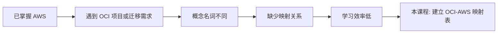

# 背景与问题

一句话说明本章要解决的问题：为什么一个已经熟悉 AWS 的人，也值得系统了解 OCI？

```mermaid
flowchart LR
    A[已掌握 AWS] --> B[遇到 OCI 项目或迁移需求]
    B --> C[概念名词不同]
    C --> D[缺少映射关系]
    D --> E[学习效率低]
    E --> F[本课程: 建立 OCI-AWS 映射表]
```

## 核心要点
* 目标听众：有 AWS 基础，需要快速理解 OCI
* 方法：不重新讲云计算基础，只讲"OCI 对应 AWS 的什么"
* 范围：计算、存储、网络、数据库、安全五大类，共 15 个常用服务
* 最终产出：一套可以直接对照使用的服务映射表
