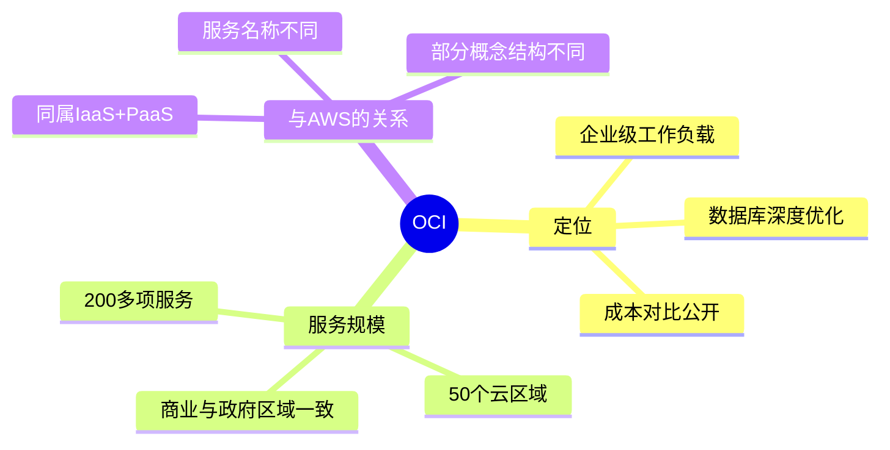

# 核心概念:什么是 OCI

一句话说明:OCI 是 Oracle 的第二代基础设施云,定位是"企业级工作负载 + 更低成本"。

## 核心要点
* OCI = Oracle Cloud Infrastructure,Oracle 的公有云基础设施平台
* 官方强调所有区域(包括政府/专用区域)服务和定价一致
* 官方给出的成本对比:计算低50%,块存储低70%,网络出站低80%(以2024年9月美国东部定价为准)
* 和 AWS 一样属于 IaaS+PaaS 综合云,但在数据库领域投入更深
