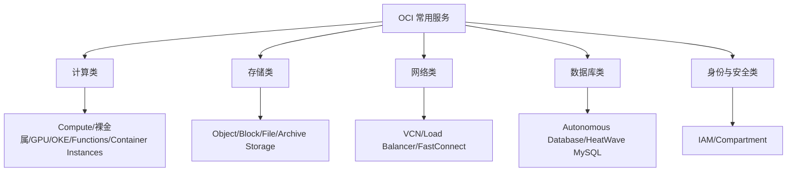

# 整体结构:OCI 五大服务分类总览

一句话说明:本课程把 OCI 常用服务归纳为五大类,逐类和 AWS 对照。

```mermaid
flowchart TD
    OCI[OCI 常用服务] --> A[计算类]
    OCI --> B[存储类]
    OCI --> C[网络类]
    OCI --> D[数据库类]
    OCI --> E[身份与安全类]

    A --> A1[Compute/裸金属/GPU/OKE/Functions/Container Instances]
    B --> B1[Object/Block/File/Archive Storage]
    C --> C1[VCN/Load Balancer/FastConnect]
    D --> D1[Autonomous Database/HeatWave MySQL]
    E --> E1[IAM/Compartment]
```

## 核心要点
* 五大类:计算、存储、网络、数据库、身份与安全
* 每一类内部会先讲总览,再逐个服务和 AWS 对照
* 本课程覆盖15个 OCI 常用服务,是200多项服务里最高频使用的部分
* 学习顺序遵循实际架构搭建顺序:先网络和计算,再存储,再数据库,最后安全
