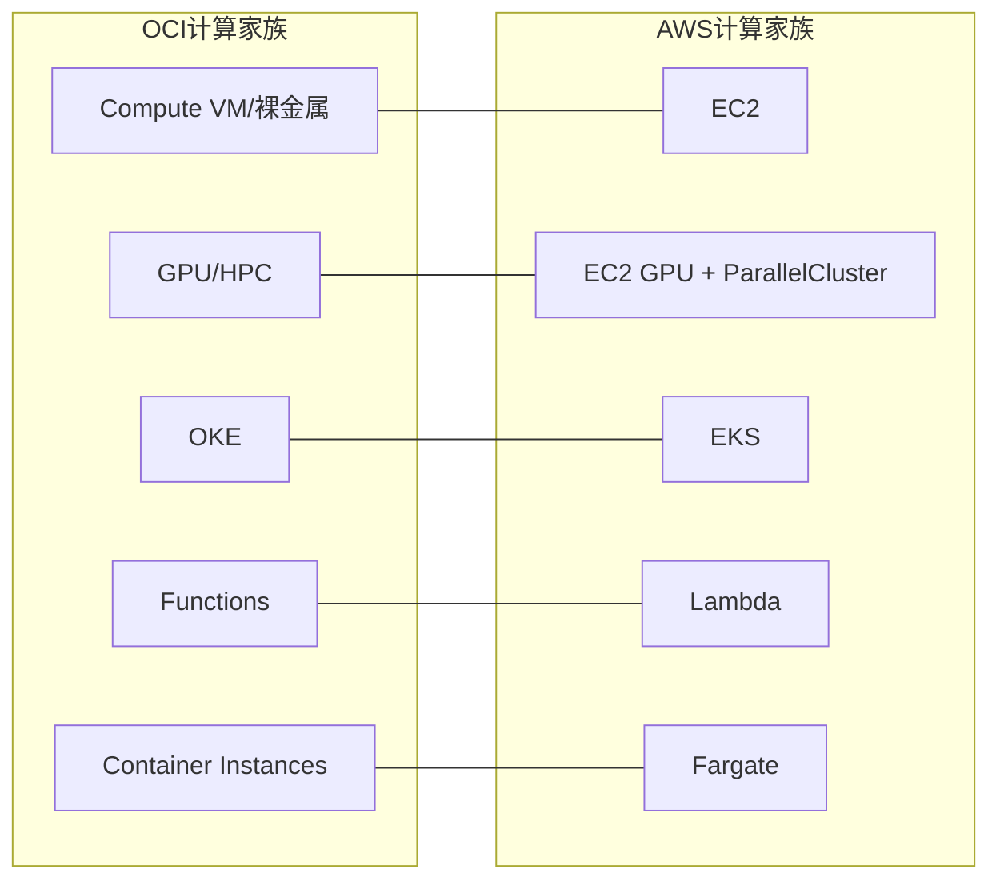

# 计算类总览:OCI Compute 家族 vs AWS EC2 家族

一句话说明:OCI 计算类服务对应 AWS 从 EC2 到 Lambda 的整条计算光谱。

## 核心要点
* OCI 计算类覆盖从"整台机器"到"无服务器函数"的完整光谱,和 AWS 完全对应
* 后续6个章节会逐一拆解:VM、计费单位、裸金属、Arm、GPU/HPC、OKE、Functions、Container Instances
* 计算类是最先要理解的一类,因为存储和网络都要挂在计算实例上使用
