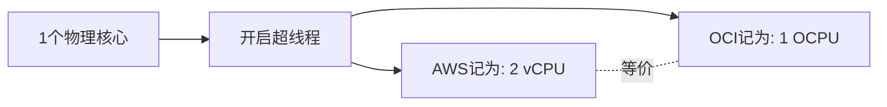

# 计费单位详解:OCPU vs vCPU

一句话说明:OCI 按 OCPU 计费,1 OCPU 大约等于 2 个 vCPU(一个物理核心的超线程)。

## 核心要点
* AWS 按 vCPU 计费:1 vCPU = 1 个超线程
* OCI 按 OCPU 计费:1 OCPU = 1 个物理核心的完整超线程对 ≈ 2 vCPU
* 换算陷阱:看到 OCI"4 OCPU"不要直接当成 AWS 的"4 vCPU",实际约等于 8 vCPU 的算力
* 做成本对比前,先把两边都换算成物理核心数,再比价格
