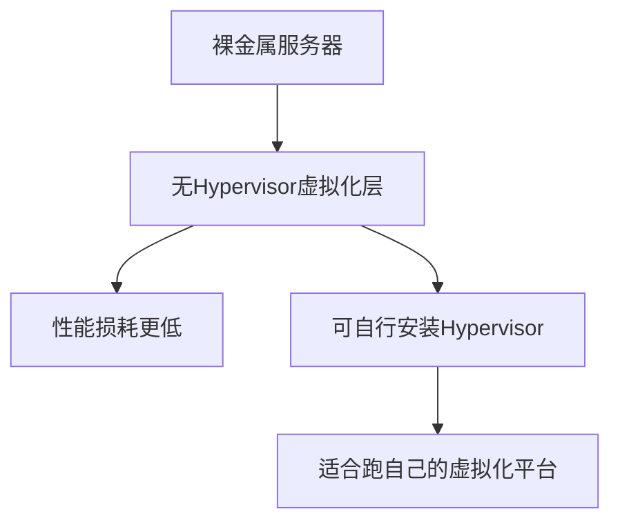

# 裸金属服务器对比

一句话说明:裸金属把整台物理机直接交给你,没有虚拟化层,OCI 在这个领域投入较早。

## 核心要点
* AWS 对应:EC2 Bare Metal 实例(如 m5.metal 系列)
* OCI:裸金属是从早期就重点投入的形态,机型选择相对丰富
* 典型场景:对性能极致敏感的数据库、需要自己装 Hypervisor(如跑 VMware)的场景
* 和 Flex VM 的关系:裸金属是"整机独占",Flex VM 是"灵活配比的虚拟机",按场景二选一
