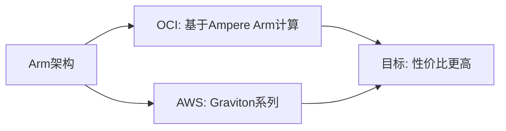

# Arm 计算对比:Ampere vs Graviton

一句话说明:两家云厂商都在用 Arm 架构芯片追求更好的性价比。

## 核心要点
* AWS Graviton:自研 Arm 芯片,追求同等性能下更低成本
* OCI 基于 Arm 的计算:同样是 Arm 架构,目标一致
* Always Free 套餐里通常包含一定额度的 Arm 计算资源,适合练手
* 迁移注意点:和 AWS 迁移到 Graviton 一样,需要确认软件依赖是否支持 Arm 架构
