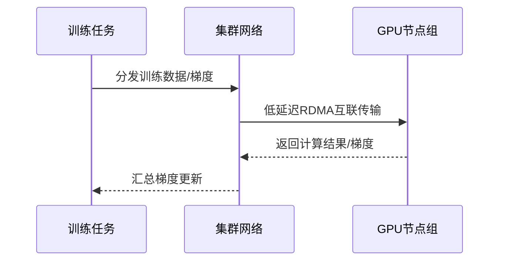

# GPU 与 HPC 计算对比

一句话说明:大规模 AI 训练需要低延迟集群网络,双方都用 RDMA/EFA 类技术解决这个问题。

## 核心要点
* AWS:EC2 P/G 系列 GPU 实例 + EFA 网络 + UltraCluster,ParallelCluster 管理HPC集群
* OCI:主推 RDMA 互联的裸金属 GPU 集群,常见搭载 H100/H200/B200
* 共同痛点:大规模分布式训练时,节点间通信延迟直接影响训练效率
* 选型关键:不只看单卡算力,还要看集群网络架构和互联带宽
