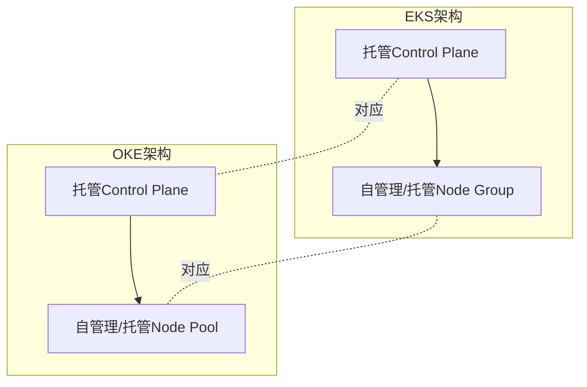

# OKE vs EKS:Kubernetes 托管服务

一句话说明:OKE 是 OCI 的托管 Kubernetes 服务,使用体验和 EKS 高度一致。

## 核心要点
* 两者都是"托管 Control Plane + 自己或托管的 Node Pool"结构
* OKE 的 Control Plane 目前不收费,具体以官方最新定价页为准
* Node Pool 可以选普通VM、裸金属,也可以用 Arm 或 GPU 节点
* 迁移 Kubernetes YAML 和应用清单基本不需要大改,主要改的是节点池和网络配置部分
