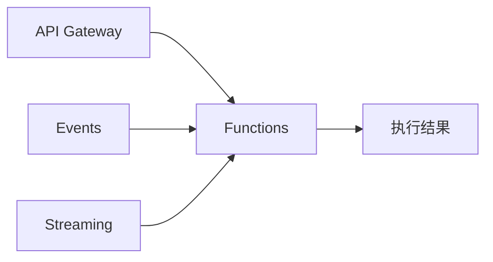

# Functions vs Lambda:Serverless 函数计算

一句话说明:OCI Functions 基于开源 Fn Project,事件驱动、按调用计费,思路和 Lambda 一致。

## 核心要点
* AWS 对应:Lambda
* 底层基于开源 Fn Project 构建,理论上具备一定的可移植性
* 触发源:API Gateway、Events(事件)、Streaming(流)等,和 Lambda 的触发器模型类似
* 计费模式:按调用次数和执行时长计费,冷启动等特性也需要类似 Lambda 的优化思路
