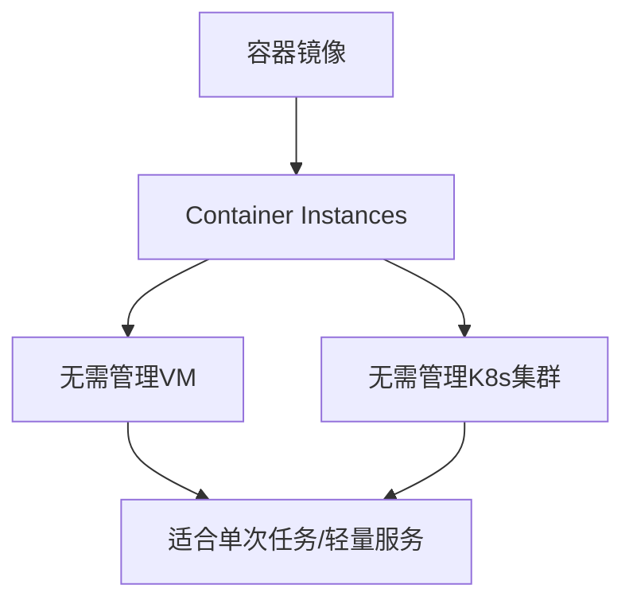

# Container Instances vs Fargate

一句话说明:不需要管理底层虚拟机或集群,直接运行单个容器/任务的服务。

## 核心要点
* AWS 对应:Fargate
* 适用场景:跑单个任务、批处理作业、轻量 API 服务,不想为此专门起一个 Kubernetes 集群
* 和 OKE 的区别:OKE 面向复杂的多容器编排场景,Container Instances 面向"我只想跑个容器"的简单场景
* 计费模式:按容器使用的 CPU/内存资源和运行时长计费,和 Fargate 逻辑一致
