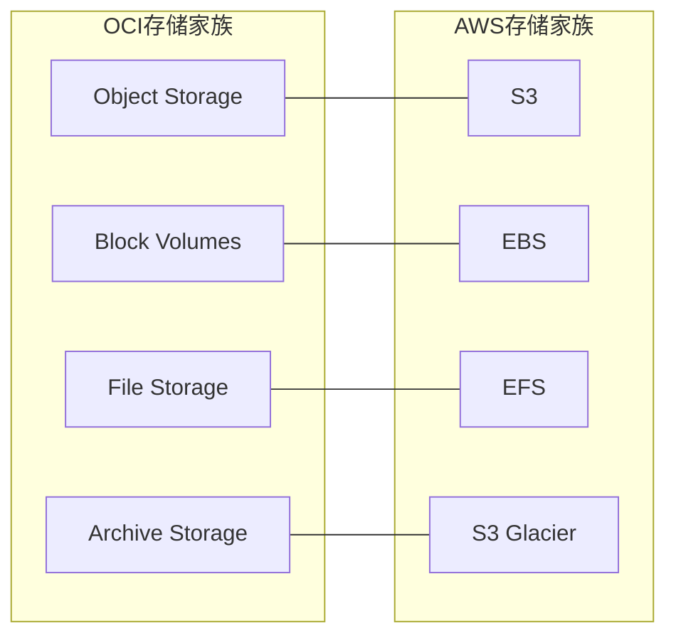

# 存储类总览

一句话说明:OCI 四种存储服务对应 AWS 存储家族里的 S3、EBS、EFS、Glacier。

## 核心要点
* Object Storage:对象存储,对应 S3
* Block Volumes:块存储,挂载在计算实例上,对应 EBS
* File Storage:托管 NFS 文件系统,对应 EFS
* Archive Storage:低频长期归档,对应 Glacier
* 官方强调的差异化优势:出站流量(Egress)费用显著低于主流云厂商
