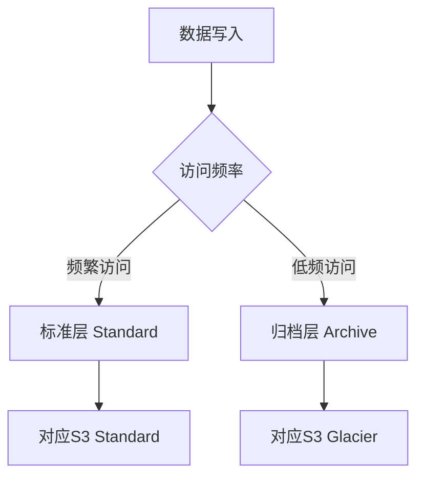

# Object Storage vs S3

一句话说明:对象存储服务,标准层/归档层的分层逻辑和 S3 类似,出站流量费用是主要差异点。

## 核心要点
* AWS 对应:S3(标准层)+ S3 Glacier(归档层)
* 存储分层逻辑类似:热数据放标准层,冷数据放归档层
* 核心差异:官方口径出站流量费用远低于 S3,大量下载/回源场景成本优势明显
* 常见用途:静态网站托管、备份、数据湖底层存储、日志归档
