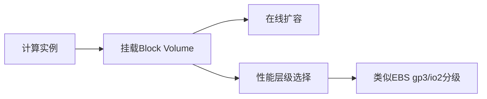

# Block Volumes vs EBS

一句话说明:挂载到计算实例上的块存储,支持在线扩容和性能分级。

```mermaid
flowchart LR
    A[计算实例] --> B[挂载Block Volume]
    B --> C[在线扩容]
    B --> D[性能层级选择]
    D --> E[类似EBS gp3/io2分级]
```

## 核心要点
* AWS 对应:EBS
* 支持在线扩容(不停机调整容量)
* 性能分级逻辑类似 EBS 的 gp3(通用型)/ io2(高性能型)
* 用途:数据库数据盘、需要持久化的应用数据目录
