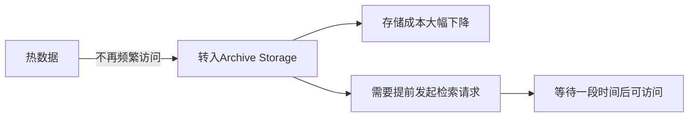

# Archive Storage vs Glacier

一句话说明:低成本长期归档存储,以检索延迟换取更低的存储费用。

## 核心要点
* AWS 对应:S3 Glacier / Glacier Deep Archive
* 适合合规留存、历史备份、很少访问但不能删除的数据
* 取回数据需要提前发起请求并等待,不能像标准层那样即时访问
* 存储类选择整体逻辑:标准层(热)→归档层(冷),四种存储服务共用同一套冷热分层思路
