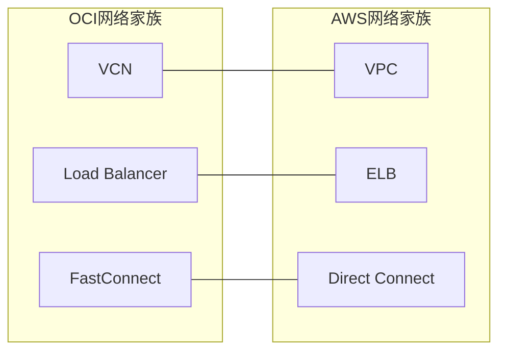

# 网络类总览

一句话说明:网络类三个核心服务 VCN、Load Balancer、FastConnect 分别对应 VPC、ELB、Direct Connect。

## 核心要点
* VCN(Virtual Cloud Network):对应 VPC,是所有部署的网络基础
* Load Balancer:对应 ELB(ALB/NLB)
* FastConnect:对应 Direct Connect,专线接入
* 网络类是承上启下的一类:计算实例要跑在VCN里,存储和数据库的私有访问也依赖VCN
