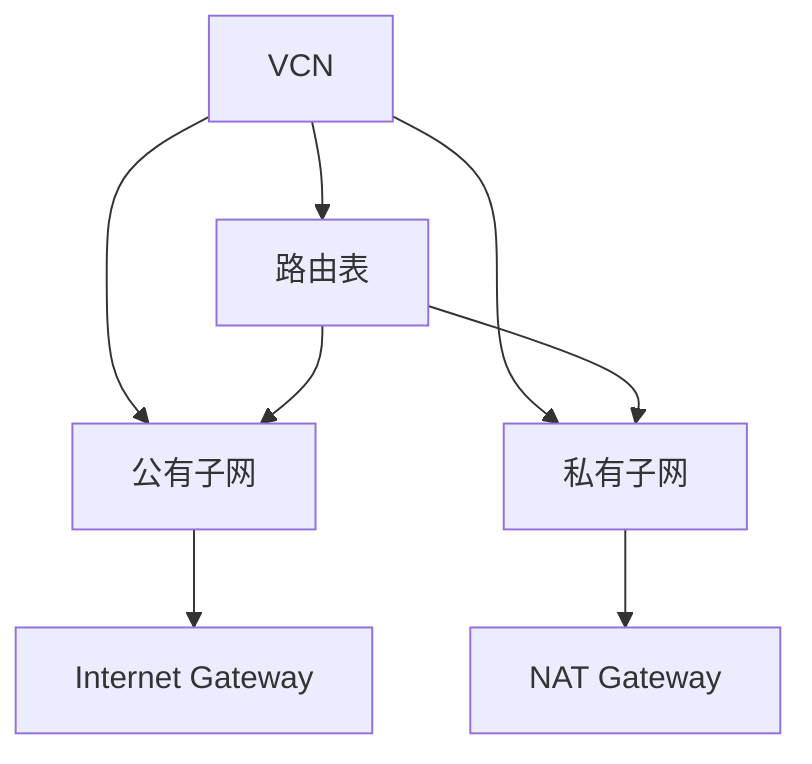

# VCN vs VPC

一句话说明:VCN 是 OCI 的虚拟私有网络,子网、路由表、网关等概念和 VPC 基本一一对应。

## 核心要点
* VCN = AWS 的 VPC,子网(Subnet)、路由表(Route Table)概念完全对应
* Internet Gateway、NAT Gateway 用法一致:公有子网出入公网、私有子网单向出网
* 计算实例、负载均衡、数据库私有访问都建立在 VCN 之上
* 安全控制部分(安全列表 vs 安全组)有细节差异,下一章专门讲
