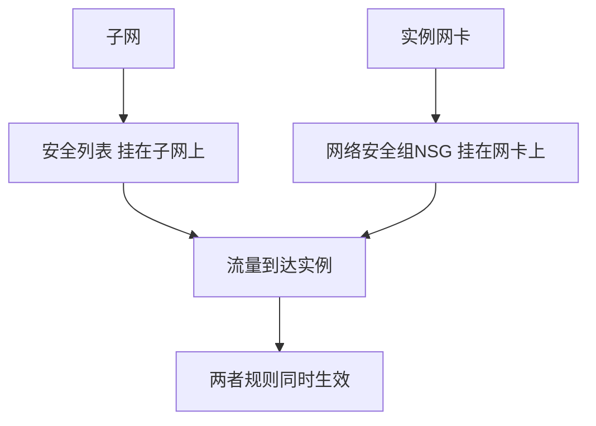

# 安全列表与NSG vs 安全组

一句话说明:OCI 有两种流量控制机制,可以叠加使用,AWS 只有安全组一种。

## 核心要点
* 安全列表(Security List):挂在子网上,类似早期网络ACL的思路,子网内所有实例共享同一套规则
* 网络安全组(NSG):挂在实例网卡上,规则跟着实例走,逻辑上更接近 AWS 安全组
* 两者可以同时使用,流量需要同时满足两边的规则才会放行
* 迁移建议:如果只用NSG,概念上和AWS安全组几乎一比一对应,更容易上手
