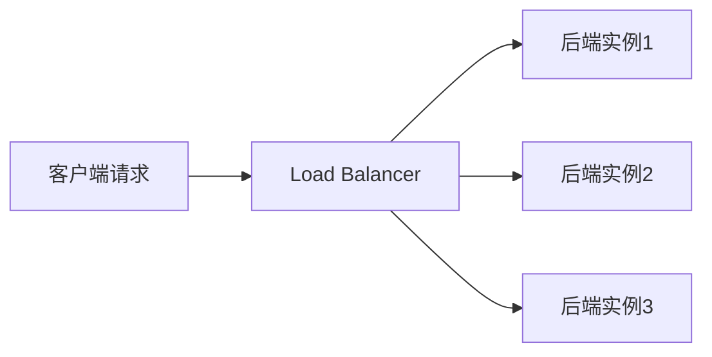

# Load Balancer vs ELB

一句话说明:四层/七层负载均衡对标 ELB,OCI 额外提供免费的四层负载均衡产品。

## 核心要点
* 七层负载均衡:对应 AWS ALB,支持基于路径/域名的路由规则
* 四层负载均衡:对应 AWS NLB,OCI 提供的四层 Network Load Balancer 按官方定价页说明为免费(具体以最新定价为准)
* AWS NLB 通常按小时和流量计费,这是双方在计费模式上的一个明显差异
* 健康检查、后端池配置等核心概念完全对应,可以照搬AWS的负载均衡设计经验
