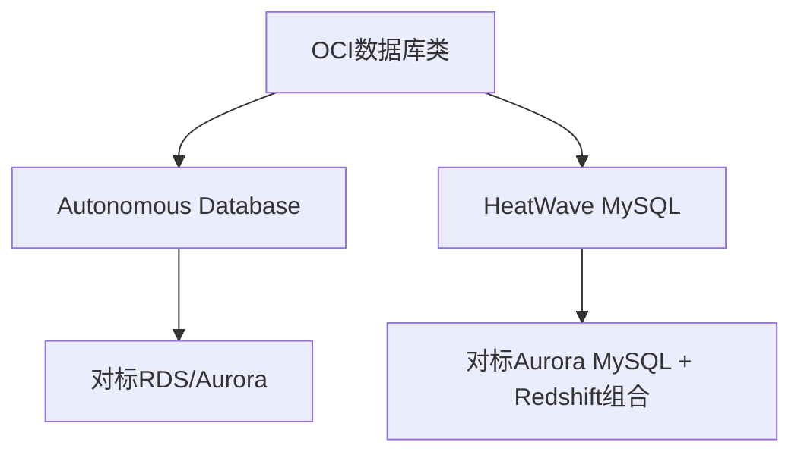

# 数据库类总览

一句话说明:数据库是 OCI 的核心优势领域,本课程聚焦 Autonomous Database 和 HeatWave MySQL 两个代表服务。

## 核心要点
* Oracle 的数据库基因让 OCI 在数据库类服务上投入最深,是它区别于 AWS 的核心差异化领域
* Autonomous Database:自治数据库,深度优化的 Oracle Database 引擎
* HeatWave MySQL:全托管 MySQL,内置内存查询加速引擎,一个实例同时做事务和分析
* 后两章会分别深入讲这两个服务和 AWS 对应产品的差异
