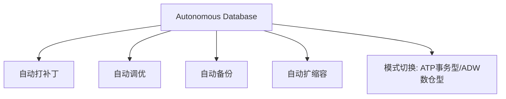

# Autonomous Database vs RDS/Aurora

一句话说明:自治数据库把日常运维工作自动化,并针对 Oracle Database 引擎深度优化。

## 核心要点
* AWS 对应:RDS(托管但仍需调参维护)+ Aurora Serverless(自动扩缩容)的结合体
* 核心差异:专门针对 Oracle Database 引擎深度优化,如果技术栈本身用 Oracle Database,价值比在 AWS 上用 RDS for Oracle 更明显
* 提供 ATP(事务处理)和 ADW(数据仓库)两种工作负载模式切换
* 适合不想投入大量DBA人力做日常运维调优的团队
