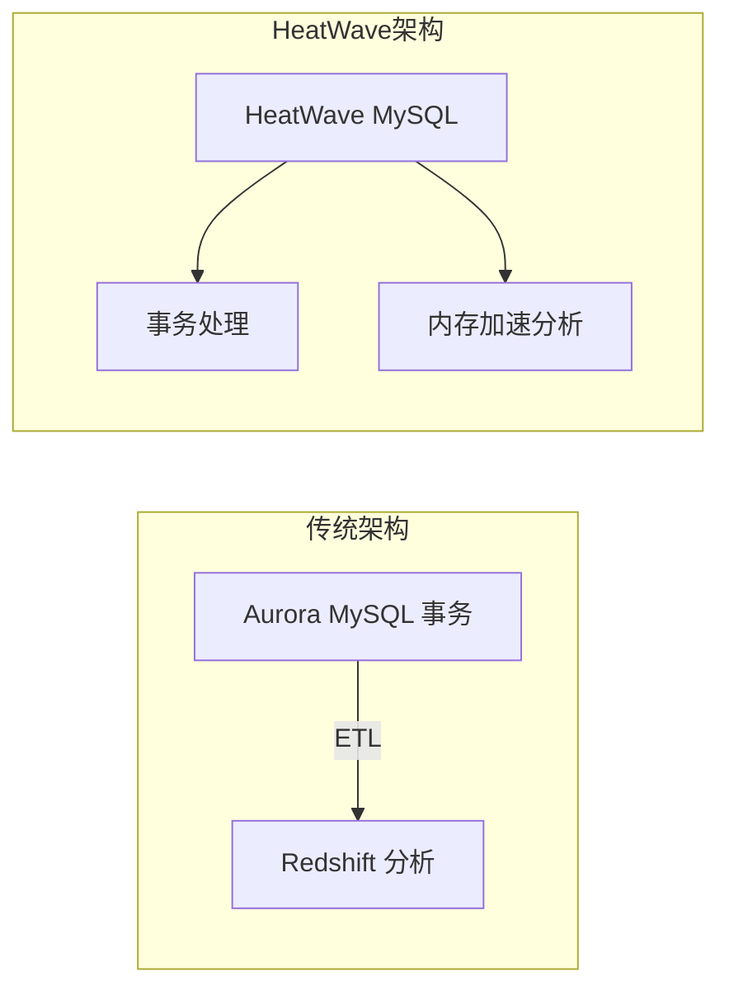

# HeatWave MySQL vs Aurora MySQL + Redshift

一句话说明:一个 MySQL 实例内置内存查询加速引擎,同时做事务处理和分析查询,免去 ETL。

## 核心要点
* AWS 对应:通常需要 Aurora MySQL(事务)+ Redshift(分析)+ ETL 管道组合实现
* HeatWave MySQL:在同一个 MySQL 实例里内置内存查询加速引擎,直接跑分析型查询
* 优势:省去 ETL 流程的复杂度、延迟和额外成本
* 适合:希望简化架构、又需要"边写业务边出报表"能力的团队
