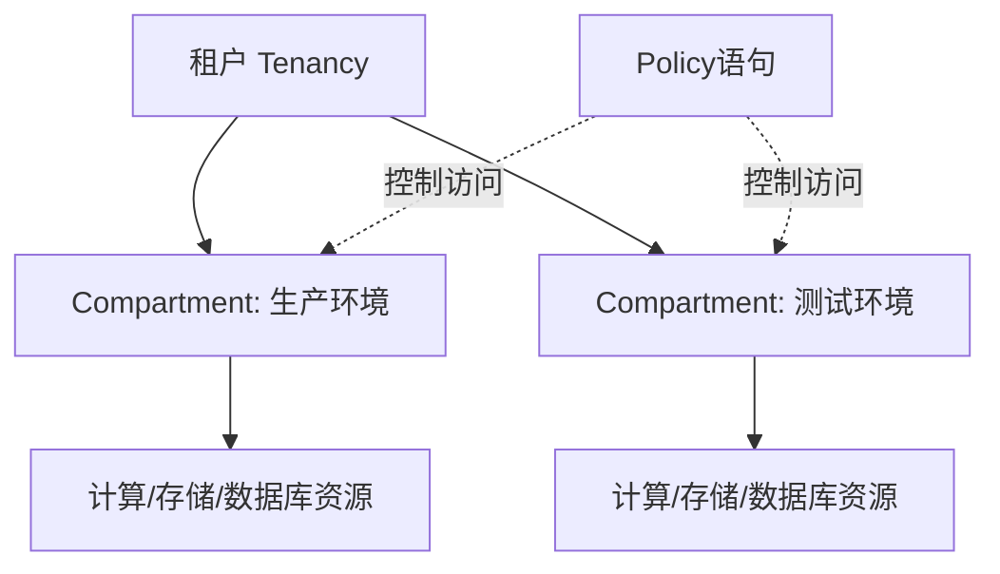

# IAM 与 Compartment vs AWS IAM

一句话说明:OCI 用 Compartment(隔间)做资源隔离,策略语法更接近自然语言。

## 核心要点
* AWS IAM:基于账号 + Organizations 做多账号隔离,策略用 JSON 文档描述
* OCI:在单个租户内用 Compartment 树状结构做资源隔离,不需要拆分成多个账号
* Policy 语句:类似自然语言,如 `Allow group Admins to manage all-resources in tenancy`
* 权衡:比 JSON 策略更直观易读,但复杂精细场景的灵活度不如 AWS IAM 策略语言
