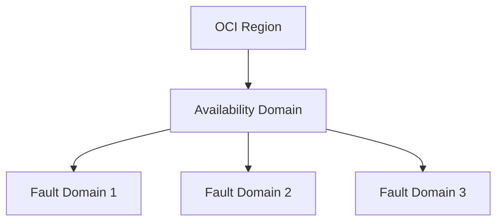

# 可用域与免费套餐:容易踩坑的细节

一句话说明:区域内的可用性单元划分方式不同,免费套餐是低成本练手的好起点。

## 核心要点
* AWS:一个 Region 通常有多个 AZ(可用区),天然支持跨AZ高可用
* OCI:Region 内划分的是 Availability Domain(AD),部分区域只有 1 个 AD,同一 AD 内再用 Fault Domain 做容错隔离
* 做高可用架构前,务必先确认目标区域的 AD 数量,不能照搬 AWS 多AZ的设计假设
* Always Free 套餐力度较大:2 个 Autonomous Database 实例、一定量 Arm 计算和存储长期免费,适合迁移小系统练手
