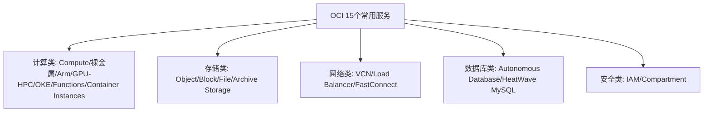

# 总结与延伸思考

一句话说明:回顾整门课程,把15个OCI服务和对应的AWS服务串成一张完整地图。

## 核心要点
* 计算类:从整机到无服务器函数,和 AWS EC2 到 Lambda 的光谱完全对应
* 存储类:Object/Block/File/Archive 四种存储对应 S3/EBS/EFS/Glacier
* 网络类:VCN/Load Balancer/FastConnect 对应 VPC/ELB/Direct Connect
* 数据库类:Autonomous Database 和 HeatWave MySQL 是 OCI 相对 AWS 最具差异化的领域
* 安全类:Compartment 树状结构和自然语言 Policy 是和 AWS IAM 差异最大的部分
* 延伸方向:可以进一步研究多云互联(如 Oracle Database@Azure)、Dedicated Region 等更高级主题
