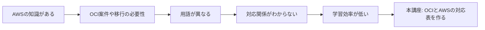

# 背景と課題

一言で言うと:AWSの基礎がある人にとって、OCIを体系的に学ぶ意味は何か。

## 要点
* 対象:AWSの基礎があり、OCIを素早く理解したい人
* 方法:クラウドの基礎から説明せず「OCIはAWSの何に対応するか」だけを説明する
* 範囲:コンピュート、ストレージ、ネットワーク、データベース、セキュリティの5分野、計15の主要サービス
* ゴール:そのまま使える対応表を手に入れること
