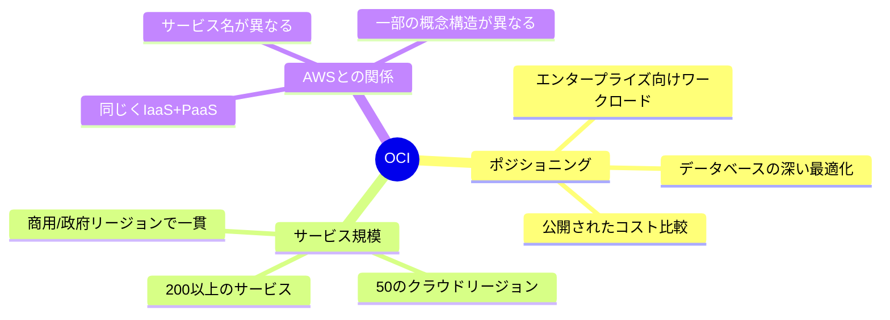

# 核心概念:OCIとは何か

一言で言うと:OCIはOracleの第二世代インフラクラウドで、「エンタープライズ向けワークロード + より低いコスト」を掲げている。

## 要点
* OCI = Oracle Cloud Infrastructure、Oracleのパブリッククラウド基盤
* 公式は全リージョン(政府/専用リージョン含む)でサービスと価格が一貫していると強調
* 公式のコスト比較:コンピュートが50%安、ブロックストレージが70%安、ネットワーク出口が80%安(2024年9月時点の米国東部価格基準)
* AWSと同じくIaaS+PaaS統合クラウドだが、データベース分野への投資がより深い
