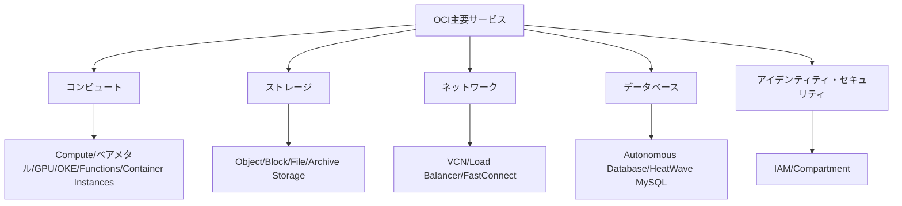

# 全体構造:OCI主要サービスの5大分類

一言で言うと:本講座ではOCIの主要サービスを5つに分類し、それぞれAWSと対応させて解説する。

## 要点
* 5大分類:コンピュート、ストレージ、ネットワーク、データベース、アイデンティティ・セキュリティ
* 各分類でまず全体像を説明し、その後各サービスをAWSと対応させて解説
* 本講座は15のOCI主要サービスをカバー、200以上のサービスの中で最も使用頻度が高い部分
* 学習順序は実際のアーキテクチャ構築順序に従う:まずネットワークとコンピュート、次にストレージ、次にデータベース、最後にセキュリティ
