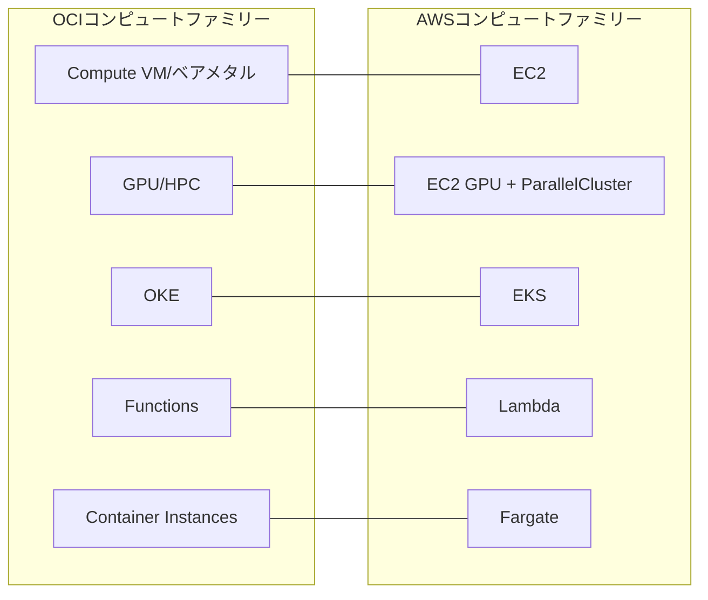

# コンピュート分類の概観:OCI Computeファミリー vs AWS EC2ファミリー

一言で言うと:OCIのコンピュート分類はAWSのEC2からLambdaまでのコンピュートスペクトラム全体に対応する。

## 要点
* OCIコンピュート分類は「一台の物理マシン」から「サーバーレス関数」までの完全なスペクトラムをカバー、AWSと完全対応
* 続く章でVM、課金単位、ベアメタル、Arm、GPU/HPC、OKE、Functions、Container Instancesを一つずつ解説
* コンピュート分類は最初に理解すべき分類。ストレージとネットワークはすべてコンピュートインスタンスに紐づけて使用するため
