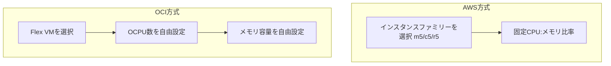

# 仮想マシン比較:Flex VM vs EC2

一言で言うと:OCIのFlex VMはCPUとメモリの比率を自分で組み立てられる。固定インスタンスファミリーを選ぶAWSとは異なる。

## 要点
* AWS EC2:先にインスタンスファミリー(汎用m/コンピュート最適化c/メモリ最適化r)を選ぶ、比率は固定
* OCI Flex VM:先にシェイプ(VM.Standard.E4.Flexなど)を選び、OCPU数とメモリGB数を自由に入力
* メリット:数GBのメモリのために次のグレードに強制アップグレードされ、CPU代を余分に払う必要がない
* ベアメタルサーバーは別の形態、次章で単独解説
