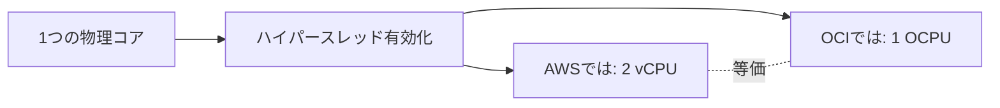

# 課金単位の詳解:OCPU vs vCPU

一言で言うと:OCIはOCPUで課金される。1 OCPUは約2 vCPU(1つの物理コアのハイパースレッド)に相当する。

## 要点
* AWSはvCPUで課金:1 vCPU = 1つのハイパースレッド
* OCIはOCPUで課金:1 OCPU = 1つの物理コアの完全なハイパースレッドペア ≈ 2 vCPU
* 換算の落とし穴:OCIの「4 OCPU」をAWSの「4 vCPU」と直接同一視しないこと。実際は約8 vCPU相当の性能
* コスト比較の前に、両者を物理コア数に換算してから価格を比較すること
