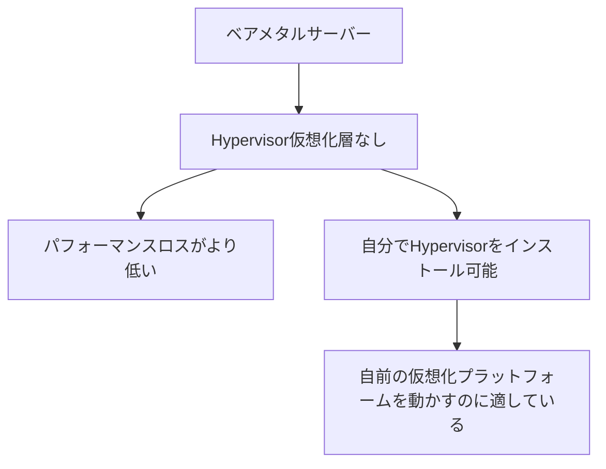

# ベアメタルサーバー比較

一言で言うと:ベアメタルは物理マシン全体をそのまま提供、仮想化層がない。OCIはこの分野に早期から投資している。

## 要点
* AWS対応:EC2ベアメタルインスタンス(m5.metalシリーズなど)
* OCI:ベアメタルは早期から重点投資してきた形態、機種の選択肢が比較的豊富
* 典型的なシナリオ:パフォーマンスに極めて敏感なデータベース、自前でHypervisor(VMwareなど)をインストールする必要があるシナリオ
* Flex VMとの関係:ベアメタルは「マシン全体を占有」、Flex VMは「柔軟な比率の仮想マシン」。シナリオに応じて選択
