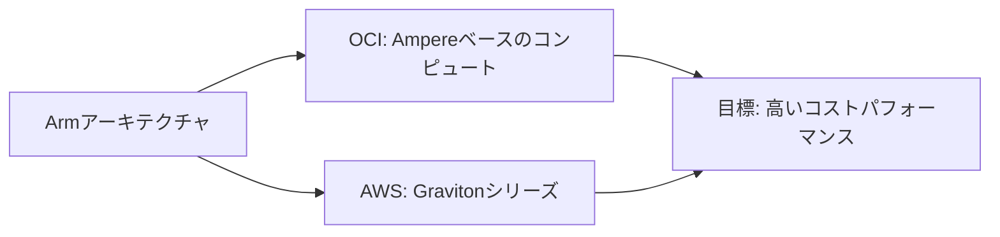

# Armコンピュート比較:Ampere vs Graviton

一言で言うと:両社ともArmアーキテクチャのチップでコストパフォーマンスを追求している。

## 要点
* AWS Graviton:自社設計のArmチップ、同等性能でより低コストを追求
* OCIのArmコンピュート:同じくArmアーキテクチャ、目標は一致
* Always Freeプランには通常一定量のArmコンピュートリソースが含まれ、練習に適している
* 移行時の注意点:AWSでGravitonに移行する際と同様、ソフトウェアの依存関係がArmアーキテクチャをサポートしているか確認が必要
